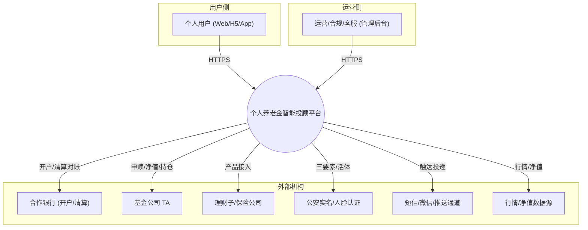
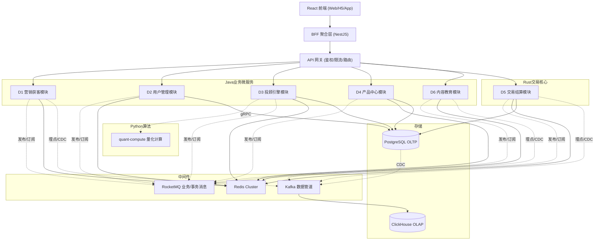
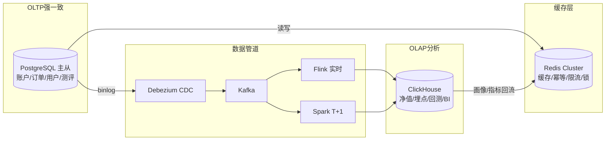
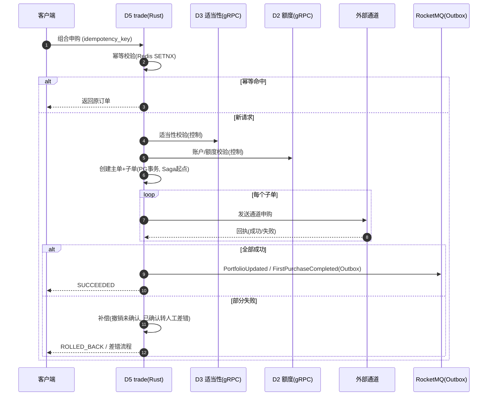
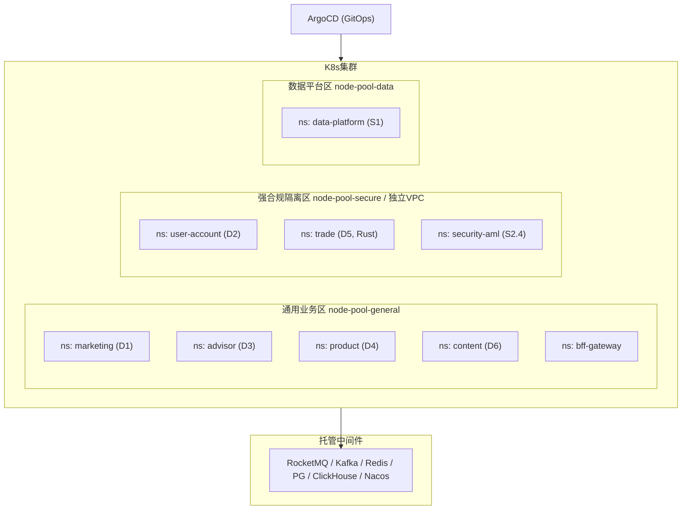
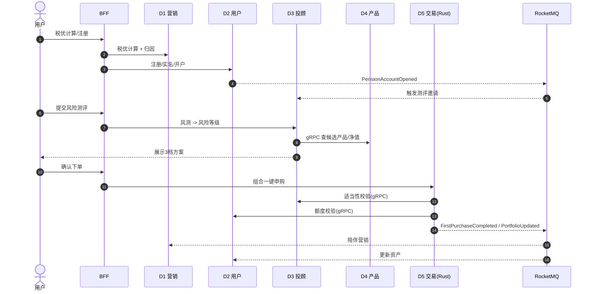
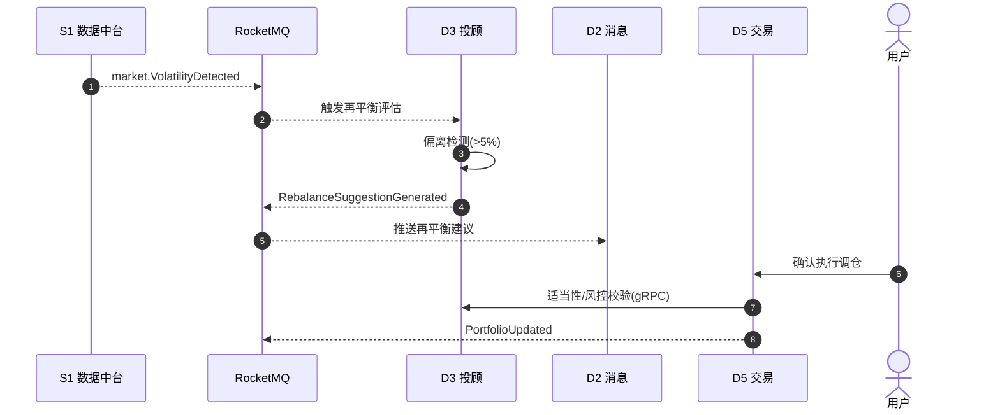
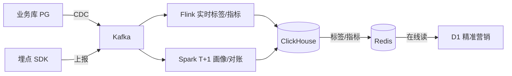

# 个人养老金智能投顾平台 · 系统架构设计总览

> **文档编号**：ARCH-OVERVIEW-PENSION-2026-001
> **版本**：V1
> **日期**：2026-07-03
> **上游文档**：
> - 《高阶需求说明书 v1.0》`docs/pension-hrs-v1.0.md`
> - 《业务模块多维度分析 V1》`docs/个人养老金智能投顾平台_业务模块多维度分析V1.md`
> - 《模块功能职责分解 V1》`docs/个人养老金智能投顾平台_模块功能职责分解V1.md`
> - 《落地增强版 v1.1》`docs/pension-prd-executable-v1.1.md`
> **状态**：初稿
> **密级**：内部公开

---

## 修订记录

| 版本 | 日期 | 修订内容 | 作者 |
|------|------|----------|------|
| V1 | 2026-07-03 | 初稿：总体架构、统一领域模型、非功能设计、部署与关键流程 | — |

---

## 0. 文档地图

本套架构文档由 **1 份总览 + 8 份业务域模块设计** 组成，每个业务域即一个独立系统模块：

| 编号 | 文档 | 对应域 |
|------|------|--------|
| 00 | 系统架构设计总览（本篇） | 全局 |
| 01 | 营销获客域 模块设计 | D1 |
| 02 | 用户管理域 模块设计 | D2 |
| 03 | 投顾引擎域 模块设计 | D3 |
| 04 | 产品中心域 模块设计 | D4 |
| 05 | 交易结算域 模块设计（Rust） | D5 |
| 06 | 内容教育域 模块设计 | D6 |
| 07 | 数据中台域 模块设计 | S1 |
| 08 | 基础平台域 模块设计 | S2 |

> 每份模块设计统一包含 6 个小节：**系统模块定义 / 系统组件定义 / 接口定义 / 分层设计 / 部署设计 / 进程设计**。本总览定义所有模块共享的**架构基线、统一领域模型与非功能规范**，模块文档不再重复。

---

## 1. 架构目标与约束

### 1.1 质量属性目标（对齐 v1.0/v1.1）

| 属性 | 目标 | 来源 |
|------|------|------|
| 性能 | 投顾方案 P95 ≤ 3s / P99 ≤ 5s；核心 API P95 ≤ 500ms | v1.1 §7.2 / NFR-02 |
| 高并发 | MVP ≥ 5,000 QPS，交易峰值可弹性扩容 | NFR-03 |
| 可用性 | 核心链路 ≥ 99.9%，MVP ≥ 99.5% | v1.0 §1.4 |
| 一致性 | 资金零差错；日对账差错率 ≤ 0.01% 且资金差异当日建单 | v1.1 §7.2 |
| 安全合规 | 等保三级、TLS1.3、AES-256+HSM、AML、适当性 100% | NFR-05~12 |
| 可审计 | 关键交易/合规事件不可篡改留痕，保留 ≥ 20 年（冷热分层） | v1.1 §6.4 |

### 1.2 技术栈基线（架构决策已定）

| 维度 | 选型 | 说明 |
|------|------|------|
| 业务微服务 | **Java 17 + Spring Boot 3 / Spring Cloud Alibaba** | D1/D2/D3/D4/D6 |
| 交易结算核心 | **Rust（axum + tokio + sqlx）** | D5 高并发、低时延、强一致 |
| 投顾算法计算 | **Python 量化计算服务（gRPC）** | D3 内的 MVO/BL/回测等重数值计算 |
| 前端 | **React + TypeScript**，前后端分离 | Web/H5，经 BFF 聚合 |
| BFF | Node.js (NestJS) | 面向端的聚合与裁剪 |
| 事务库(OLTP) | **PostgreSQL 16**（主从 + 分库分表） | 账户/订单/用户/测评 |
| 分布式缓存 | **Redis 7 Cluster** | 缓存/限流/幂等/分布式锁/热点 |
| 历史/分析库(OLAP) | **ClickHouse** | 净值序列/行为埋点/回测/BI |
| 消息中间件 | **RocketMQ**（业务+事务消息） + **Kafka**（数据管道） | 交易事务消息走 RocketMQ；埋点/CDC 走 Kafka |
| 服务间同步 | **gRPC**（内部）/ **REST**（对端，经 BFF） | Protobuf 作为跨语言契约源 |
| 注册配置 | **Nacos** | 服务注册 + 配置中心（S2.2） |
| 容器编排 | **Kubernetes + ArgoCD** | GitOps 部署（S2.5） |
| 可观测 | **Prometheus + Grafana + ELK + SkyWalking** | S2.3 |

### 1.3 架构原则

1. **域即模块**：每个业务域是一个限界上下文，独立部署、独立数据存储，禁止跨域直连数据库。
2. **弱耦合优先**：域间默认走**领域事件（EDA）**；仅交易、适当性等强一致场景使用 gRPC 同步调用/控制依赖。
3. **读写分离**：OLTP（PG）与 OLAP（ClickHouse）物理分离，通过 CDC/数据中台异步同步。
4. **金融正确性优先**：幂等、Saga、状态机单向流转、Outbox 事件、全链路审计（详见 §4.3）。
5. **合规隔离**：资金与个人信息相关模块（D2/D5/S2.4）划入**强合规隔离区**（独立 VPC/节点池）。

---

## 2. 总体架构

### 2.1 C4 - 系统上下文图（Context）



### 2.2 C4 - 容器/服务全景图（Container）



### 2.3 业务域 → 模块 → 技术栈映射

| 域 | 系统模块 | 核心服务（组件） | 语言/栈 | 主存储 |
|----|----------|------------------|---------|--------|
| D1 | marketing-module | profile / reach / tax-calc / abtest / referral | Java | PG + Redis + CK |
| D2 | user-module | user / pension-account / member / message | Java | PG + Redis |
| D3 | advisor-module | risk / allocation / recommend / rebalance + quant-compute(Py) | Java + Python | PG + Redis + CK |
| D4 | product-module | ingest / catalog / detail / rating | Java | PG + Redis + CK |
| D5 | trade-module | trade / settlement / recon / trade-risk | **Rust** | PG + Redis |
| D6 | content-module | knowledge / simulator / cms | Java | PG + CK |
| S1 | data-platform | collect / realtime(Flink) / offline(Spark) / warehouse(CK) / governance | 多栈 | CK |
| S2 | infra-platform | gateway / config(Nacos) / observability / security / cicd | 多栈 | — |

### 2.4 通信矩阵

| 场景 | 方式 | 说明 |
|------|------|------|
| 前端 ↔ 平台 | REST/HTTPS 经 BFF | 端侧聚合与裁剪 |
| 网关 ↔ 服务 | HTTP/gRPC | 统一鉴权后路由 |
| 域间同步（强一致） | **gRPC** | 如 D5→D3 适当性校验、D5→D4 下单校验、D5→D2 额度校验 |
| 域间异步（弱耦合） | **RocketMQ 领域事件** | 首投/再平衡/营销触发等事件链路 |
| 数据落仓 | **Kafka + CDC(Debezium)** | PG → Kafka → ClickHouse/Flink |

---

## 3. 统一领域模型（Shared Kernel）

### 3.1 通用领域原语

以 **Protobuf/JSON Schema 为跨语言契约源**，Java 侧生成公共 jar（`pension-domain-commons`），Rust/Python 侧生成对应 struct，保证语义一致。

| 原语 | 说明 | 关键约束 |
|------|------|----------|
| `Money` | 金额 | 高精度 Decimal(18,2)，禁用浮点；带币种 |
| `RiskLevel` | 风险等级 | 枚举 C1~C5，全域统一 |
| `UserId` / `ProductId` / `OrderId` | 标识符 | 带前缀的字符串 ID（`u_`/`fund_`/`po_`） |
| `ProductRiskLevel` | 产品风险等级 | R1~R5，与 C1~C5 映射用于适当性 |
| `AuditEvent` | 审计事件 | 不可篡改，含 actor/action/timestamp/hash 链 |
| `DomainEvent<T>` | 领域事件信封 | eventId/type/occurredAt/source/traceId/payload |

### 3.2 领域事件信封（统一格式）

```json
{
  "eventId": "evt_9f56...",
  "eventType": "trade.FirstPurchaseCompleted",
  "occurredAt": "2026-07-03T02:31:00Z",
  "source": "trade-module",
  "traceId": "tr_abc123",
  "version": "1.0",
  "payload": { }
}
```

### 3.3 核心领域事件目录（节选，跨域契约）

| 事件类型 | 生产者 | 主要消费者 | 用途 |
|----------|--------|-----------|------|
| `user.UserRegistered` | D2 | D1 | 启动新手旅程 |
| `user.RealNameVerified` | D2 | D2/D3 | 触发开户/测评引导 |
| `account.PensionAccountOpened` | D2 | D3 | 触发风险测评邀请 |
| `advisor.RiskAssessmentCompleted` | D3 | D3/D1 | 触发方案生成/画像更新 |
| `advisor.AllocationRecommended` | D3 | D5/D2 | 方案展示与推送 |
| `trade.FirstPurchaseCompleted` | D5 | D1/D2 | 陪伴营销/资产更新 |
| `trade.PortfolioUpdated` | D5 | D2/D3 | 更新资产/再平衡判断 |
| `market.VolatilityDetected` | S1 | D3 | 触发再平衡评估 |
| `advisor.RebalanceSuggestionGenerated` | D3 | D2 | 推送再平衡建议 |

> 事件契约与业务模块多维度分析 V1 §4.1.2 的事件链路一一对应。

---

## 4. 非功能设计

### 4.1 高并发与缓存（Redis）

| 场景 | Redis 用法 | 防护策略 |
|------|-----------|----------|
| 热点产品/净值 | String/Hash 缓存 | 本地二级缓存(Caffeine) + 逻辑过期防击穿 |
| 会话与令牌 | 令牌存储 | TTL + 滑动续期 |
| 接口限流 | 令牌桶/滑动窗口(Lua) | 网关侧 + 服务侧双层 |
| 幂等键 | `idempotency_key` 24h | SETNX + 原子校验，命中返回原结果 |
| 分布式锁 | RedLock/单实例锁 | 锁续期看门狗，防死锁 |
| 热点标签 | 画像标签缓存 | 空值缓存防穿透，布隆过滤器 |

### 4.2 数据架构（OLTP / OLAP 分离）



- **PG**：承载所有需强一致与事务的实体；按 `user_id` 哈希分库分表，读多写少表走读从库。
- **ClickHouse**：承载海量时序/行为/回测数据与 BI，不参与在线事务。
- **一致性边界**：跨库不做分布式 join；分析结果以 T+1 或近实时(秒级)回流缓存供在线读。

### 4.3 交易一致性（金融正确性核心）



- **幂等**：客户端+服务端双层，`idempotency_key` + 请求摘要哈希，24h 窗口（v1.1 §6.1）。
- **Saga + Outbox**：本地事务写业务表与 outbox 表，异步投递 RocketMQ，保证"下单-事件"最终一致。
- **状态机**：`INIT→PENDING_CONFIRM→PROCESSING→SUCCEEDED/FAILED/ROLLED_BACK` 单向流转，禁止逆转。
- **对账**：T+1 批处理 + 关键时段增量核对；资金差异自动建 P0 工单（v1.1 §6.3）。

### 4.4 性能与容量

| 服务 | SLO | 扩容策略 |
|------|-----|----------|
| BFF/网关 | P95 ≤ 200ms | HPA 按 QPS/CPU |
| 投顾方案 | P95 ≤ 3s / P99 ≤ 5s，超时降级基础方案 | quant-compute 独立弹性池 |
| 交易(Rust) | P99 ≤ 800ms，峰值不降级 | 交易核心预留水位 + 队列削峰 |
| 产品列表 | 首屏 ≤ 1s | Redis 缓存 + CK 预聚合 |

### 4.5 可用性与容灾

- **多 AZ 部署**，无状态服务多副本；PG 主从跨 AZ + 自动切换；Redis Cluster 分片高可用。
- **降级**：投顾超时返回基础 TRF 方案；产品详情降级到缓存快照。
- **熔断限流**：Sentinel（Java）+ 网关限流；交易通道不可用切备用通道或熔断（v1.1 §10.2）。
- **灰度回滚**：ArgoCD 金丝雀发布，P0 资金告警自动暂停新增交易入口。

### 4.6 安全与合规

| 层 | 措施 |
|----|------|
| 传输 | 全链路 TLS 1.3 |
| 存储 | 身份证/银行卡 AES-256 字段级加密，密钥 HSM 托管 |
| 访问 | OAuth2 + JWT，最小权限，敏感操作二次验证 |
| 合规隔离 | D2/D5/S2.4 划入强合规区（独立 VPC/节点池 + 网络策略） |
| 审计 | 关键事件写不可篡改审计流（哈希链），冷热分层保留 ≥ 20 年 |
| AML | 独立可疑交易监测（S2.4），与交易风控(D5.6)职责分离 |

### 4.7 可观测性

- **指标**：Prometheus 采集 + Grafana 看板（含业务看板：注册/开户/投资/AUM/对账）。
- **日志**：ELK 集中检索；交易与合规日志独立索引，权限隔离。
- **链路**：SkyWalking 全链路追踪，`traceId` 贯穿 REST/gRPC/事件。
- **告警**：分级告警（P0 资金 > P1 状态 > P2 体验），灰度期收紧交易阈值。

---

## 5. 部署架构



- **节点池隔离**：通用区、强合规区、数据区分节点池；合规区独立 VPC + 严格网络策略（NetworkPolicy）。
- **命名空间按域**：每域独立 namespace，资源配额与故障域隔离。
- **GitOps**：ArgoCD 声明式部署，环境（dev/staging/gray/prod）配置分离于 Nacos。
- **灰度**：内部白名单 → 小流量 → 全量；金丝雀 + 一键回滚。

---

## 6. 关键端到端流程（进程视角）

### 6.1 新用户首投链路（跨域编排）



### 6.2 再平衡链路（事件驱动）



### 6.3 数据落仓与画像回流（批/流）



---

## 7. 附录

### 7.1 架构决策记录（ADR 摘要）

| 编号 | 决策 | 理由 | 取舍 |
|------|------|------|------|
| ADR-01 | 交易结算用 Rust | 高并发、低时延、内存安全、强一致 | 团队学习成本，需配套人才 |
| ADR-02 | 业务服务用 Java | 生态成熟、招聘友好、Spring Cloud Alibaba 完整 | — |
| ADR-03 | 投顾重算法用 Python | 量化/科学计算生态（numpy/cvxpy） | 增加一门语言，用 gRPC 隔离 |
| ADR-04 | RocketMQ + Kafka 双栈 | 事务消息(金融) + 数据吞吐(分析) 各取所长 | 运维两套 MQ |
| ADR-05 | PG(OLTP) + ClickHouse(OLAP) 分离 | 事务与分析负载解耦 | 需 CDC 数据管道 |
| ADR-06 | 域间 gRPC + 事件 EDA | 强一致走同步、弱耦合走异步 | 契约治理成本 |
| ADR-07 | 强合规隔离区 | 满足等保三级与资金/个人信息隔离 | 资源成本上升 |

### 7.2 技术栈版本基线

| 组件 | 版本 |
|------|------|
| Java | 17（LTS） |
| Spring Boot / Cloud | 3.x / 2023.x |
| Rust | stable ≥ 1.75 |
| Python | 3.11 |
| React / TS | 18 / 5.x |
| PostgreSQL | 16 |
| Redis | 7.x（Cluster） |
| ClickHouse | 24.x |
| RocketMQ / Kafka | 5.x / 3.x |
| Kubernetes | 1.29+ |

### 7.3 待细化项（下一版）

- 各服务的容量模型与压测基线数据
- Protobuf 契约仓库与版本兼容策略（向后兼容规则）
- 多活/异地容灾方案（RPO/RTO 目标）
- 密钥轮转与 HSM 集成细节

> 本总览定义全局架构基线；各业务域的模块级设计详见 01~08 号文档。
