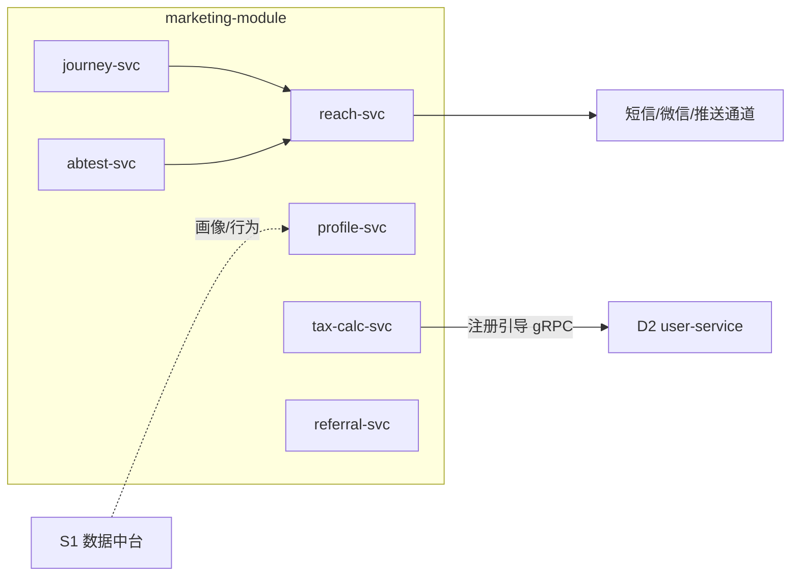
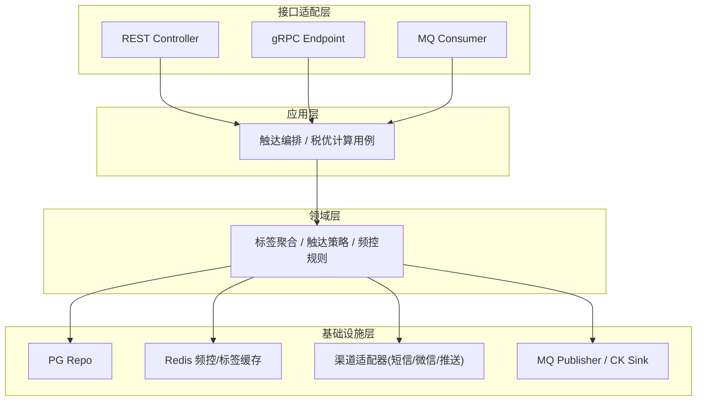
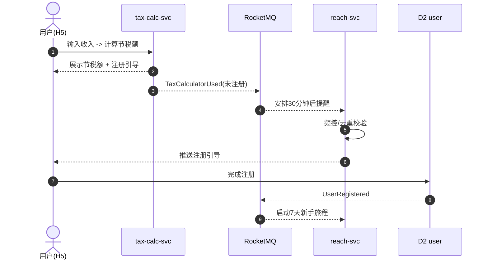
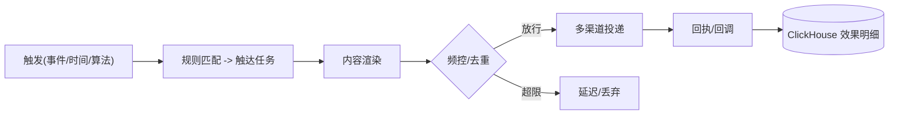

# D1 营销获客域 · 模块设计

> **文档编号**：ARCH-D1-PENSION-2026-001 · **版本**：V1 · **日期**：2026-07-03
> **上游**：《系统架构设计总览 V1》`00_系统架构设计总览V1.md`
> 全局架构基线、统一领域模型、非功能规范以总览为准，本文只描述本域特有设计。

---

## 1. 系统模块定义

| 项 | 内容 |
|----|------|
| 模块名 | `marketing-module`（营销获客域） |
| 限界上下文职责 | 从外部流量获客、构建用户画像标签、精准触达、税优获客工具、AB 实验与裂变 |
| 技术栈 | Java 17 + Spring Boot 3；存储 PG（配置/关系）+ Redis（标签热缓存/频控）+ ClickHouse（效果分析） |
| 上游依赖 | S1 数据中台（画像/行为回流）、S2 基础平台 |
| 下游/协作 | D2（引导注册，gRPC）；订阅 D2/D5/D6 事件丰富画像并触发触达 |
| 关键约束 | 触达频控（单日 ≤3 推送）、合规文案审核、个人信息授权（PIPL） |
| 承载功能 | 对应职责分解 V1 的 D1.1~D1.6 共 32 个功能 |

---

## 2. 系统组件定义

| 组件 | 职责 | 承载功能点 |
|------|------|-----------|
| `profile-svc` 画像标签服务 | 标签计算/查询/元数据 | D1.1-F1~F6 |
| `reach-svc` 精准触达引擎 | 触发匹配、内容渲染、多渠道投递、频控/去重、效果回收 | D1.2-F1~F8 |
| `journey-svc` 营销自动化工坊 | 旅程编排/执行/跟踪/统计 | D1.3-F1~F4 |
| `abtest-svc` A/B 实验平台 | 实验配置/分流/采集/显著性 | D1.4-F1~F4 |
| `referral-svc` 裂变服务 | 邀请关系/任务/归因/发奖 | D1.5-F1~F4 |
| `tax-calc-svc` 税优计算器 | 税优计算/H5/分享/邀请码/注册引导 | D1.6-F1~F6 |

> MVP（v1.1 Iteration-1）仅交付 `tax-calc-svc` + `profile-svc`（基础标签）+ 渠道归因；`journey/abtest/referral` 属 P1/P2。



---

## 3. 接口定义

### 3.1 对端 REST（经 BFF）

| 接口 | 方法 | 说明 |
|------|------|------|
| `/api/v1/marketing/tax-calc` | POST | 税优计算（收入+城市→节税额） |
| `/api/v1/marketing/tax-calc/share` | POST | 生成分享物料（海报/链接+邀请码） |
| `/api/v1/marketing/profile/{userId}` | GET | 查询用户标签视图（内部/受限） |

税优计算示例：

```json
// POST /api/v1/marketing/tax-calc
{ "annualIncome": 300000, "city": "shanghai", "channel": {"utm_source":"douyin","campaignId":"c_01","inviteCode":"INV123"} }
// 200
{ "taxSaved": 1080.00, "marginalRate": 0.09, "shareToken": "sh_abc" }
```

### 3.2 域间同步（gRPC）

| RPC | 目标 | 用途 |
|-----|------|------|
| `TagQuery.BatchGet` | 本域对外 | 供 D3 读取金融/画像标签 |
| `Registration.Guide` | → D2 | 计算完成引导注册 |

### 3.3 订阅/发布事件（RocketMQ）

| 方向 | 事件 | 处理 |
|------|------|------|
| 订阅 | `user.UserRegistered` | 启动新手旅程、绑定裂变关系 |
| 订阅 | `advisor.RiskAssessmentCompleted` | 更新金融标签 |
| 订阅 | `trade.FirstPurchaseCompleted` | 触发陪伴营销 |
| 发布 | `marketing.TaxCalculatorUsed` | 未注册用户 → 安排注册提醒 |
| 发布 | `marketing.ReachDelivered` | 触达效果统计 |

---

## 4. 分层设计（DDD 六边形）



---

## 5. 部署设计

| 项 | 方案 |
|----|------|
| 部署区 | 通用业务区 `node-pool-general`，`ns: marketing` |
| 副本 | 各服务无状态多副本，HPA 按 QPS/CPU |
| 缓存 | Redis：频控计数、标签热缓存、税优结果短期缓存 |
| 数据 | PG 存旅程/实验/关系配置；效果明细异步入 ClickHouse |
| 弹性 | 大促/推送高峰对 `reach-svc` 单独扩容 + 消息削峰 |

---

## 6. 进程设计

### 6.1 税优获客 → 注册转化（营销闭环）



### 6.2 触达执行（频控与效果回收）


