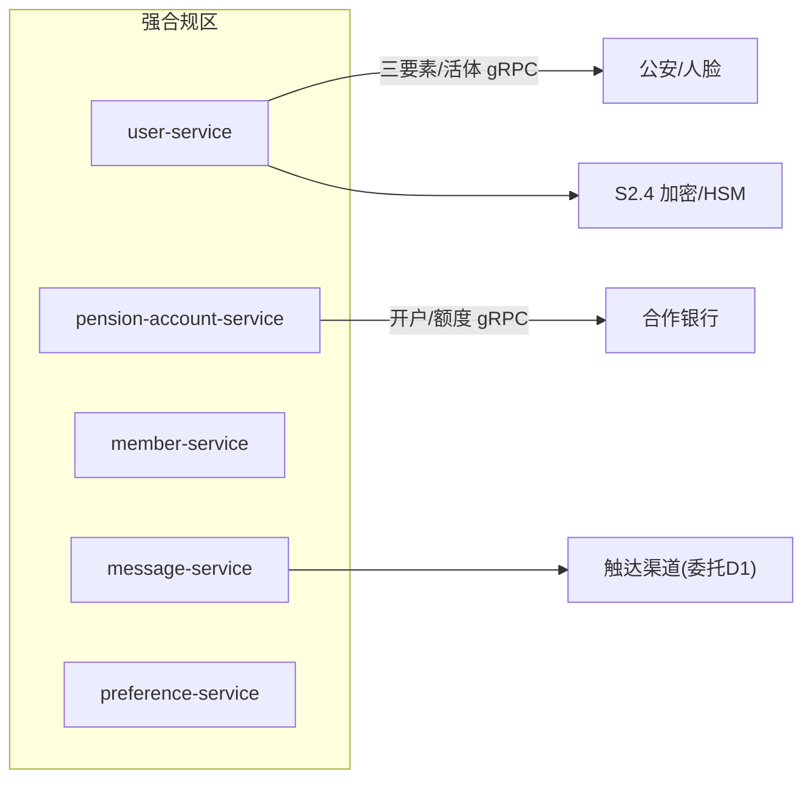
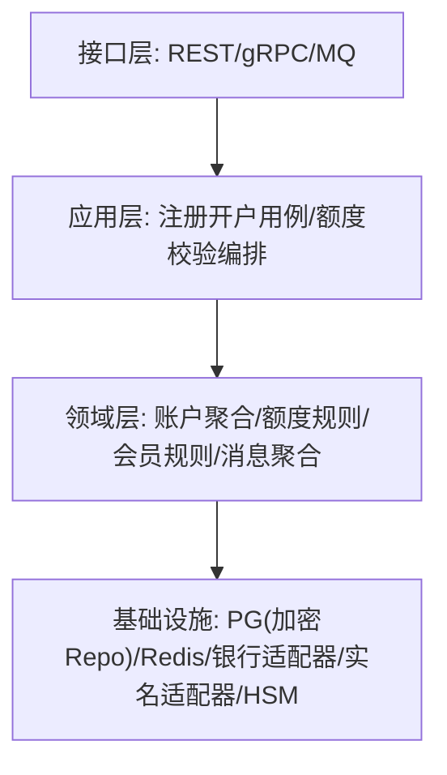
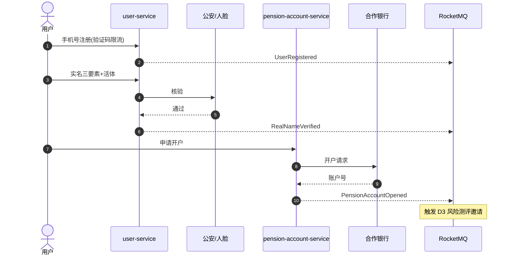
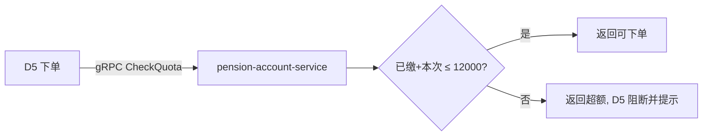

# D2 用户管理域 · 模块设计

> **文档编号**：ARCH-D2-PENSION-2026-001 · **版本**：V1 · **日期**：2026-07-03
> **上游**：《系统架构设计总览 V1》`00_系统架构设计总览V1.md`
> 全局基线以总览为准。本域属**强合规隔离区**，安全等级最高。

---

## 1. 系统模块定义

| 项 | 内容 |
|----|------|
| 模块名 | `user-module`（用户管理域） |
| 限界上下文职责 | 账户注册认证、养老金账户开户与额度、会员体系、消息通知、用户偏好 |
| 技术栈 | Java 17 + Spring Boot 3；PG（账户/额度，字段级加密）+ Redis（会话/验证码/额度缓存） |
| 上游依赖 | 公安实名/人脸、合作银行、S2 安全设施（HSM/加密） |
| 下游/协作 | 被 D1/D3/D5 依赖（被依赖度最高之一）；发布账户/注册事件 |
| 关键约束 | 等保三级、PIPL 最小采集与授权、三要素/活体、年度额度硬约束 |
| 承载功能 | D2.1~D2.5 共 26 个功能 |

---

## 2. 系统组件定义

| 组件 | 职责 | 承载功能点 |
|------|------|-----------|
| `user-service` | 注册、验证码、实名、人脸、KYC、登录、注销 | D2.1-F1~F7 |
| `pension-account-service` | 开户、状态同步、余额、额度计算、超额拦截、归集 | D2.2-F1~F6 |
| `member-service` | 等级评定、权益、费率折扣、变更通知 | D2.3-F1~F4 |
| `message-service` | 接收分类、偏好、免打扰过滤、已读状态、存储查询 | D2.4-F1~F5 |
| `preference-service` | 投资/通知/界面偏好读写与聚合查询 | D2.5-F1~F4 |

> MVP（Iteration-1）交付 `user-service` + `pension-account-service`（单银行）+ `message-service`（交易/合规通知）；`member/preference` 属 P1。



---

## 3. 接口定义

### 3.1 对端 REST（经 BFF）

| 接口 | 方法 | 说明 |
|------|------|------|
| `/api/v1/users/register` | POST | 手机号注册 |
| `/api/v1/users/real-name` | POST | 实名三要素+活体 |
| `/api/v1/users/kyc` | POST | KYC 信息采集 |
| `/api/v1/pension-accounts` | POST | 养老金账户开户 |
| `/api/v1/pension-accounts/{id}/quota` | GET | 年度已缴/可缴额度 |
| `/api/v1/messages` | GET | 消息列表（分类/已读） |

开户示例：

```json
// POST /api/v1/pension-accounts  { "userId": "u_123", "bankCode": "CMB" }
// 200  { "accountId": "pa_001", "status": "OPENED", "annualQuota": 12000.00 }
```

### 3.2 域间同步（gRPC，被调用为主）

| RPC | 调用方 | 用途 |
|-----|--------|------|
| `Account.CheckQuota` | D5 交易 | 下单前年度额度校验（控制依赖） |
| `Account.GetBalance` | D5/D3 | 资金余额查询 |
| `User.GetRiskProfile` | D3 投顾 | 读取用户基础/风险信息 |

### 3.3 事件（RocketMQ）

| 方向 | 事件 |
|------|------|
| 发布 | `user.UserRegistered` / `user.RealNameVerified` / `account.PensionAccountOpened` |
| 订阅 | `trade.PortfolioUpdated`（更新资产视图）、`advisor.RebalanceSuggestionGenerated`（推送消息） |

---

## 4. 分层设计



- **字段级加密**：`mobile/real_name/id_no` 在基础设施层透明加解密，密钥经 HSM（S2.4-F3）。
- **额度规则**在领域层内聚，`CheckQuota` 只判定、拦截动作由调用方（D5）执行，符合 SRP。

---

## 5. 部署设计

| 项 | 方案 |
|----|------|
| 部署区 | **强合规隔离区** `node-pool-secure`（独立 VPC），`ns: user-account` |
| 网络 | 严格 NetworkPolicy，仅允许网关与授权服务访问；外呼银行/公安走专线/白名单 |
| 存储 | PG 主从跨 AZ，敏感字段加密；Redis 独立实例（会话/验证码/额度） |
| 高可用 | 多副本 + PG 自动切换；账户状态同步幂等重试 |
| 审计 | 实名/KYC/账户状态变更写不可篡改审计流 |

---

## 6. 进程设计

### 6.1 注册-实名-开户主流程（MVP 核心链路）



### 6.2 交易前额度校验（被 D5 调用）


