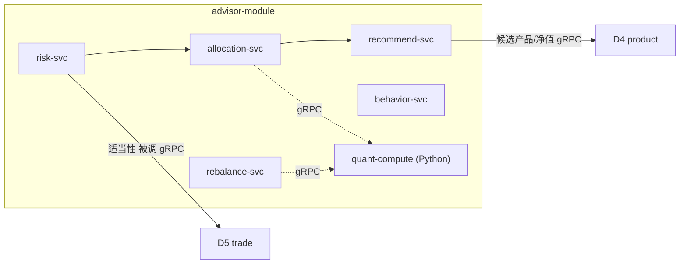
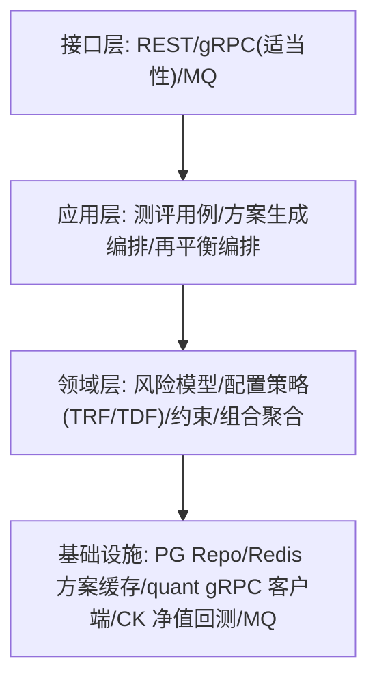
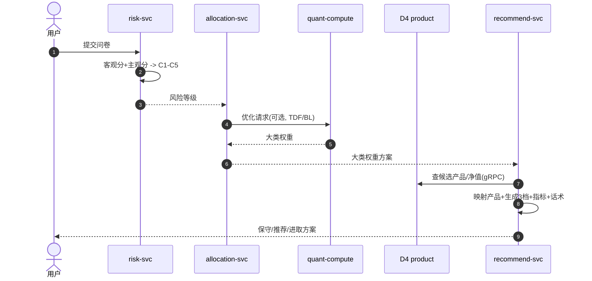
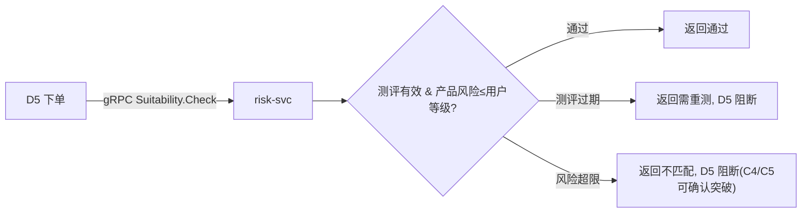

# D3 投顾引擎域 · 模块设计

> **文档编号**：ARCH-D3-PENSION-2026-001 · **版本**：V1 · **日期**：2026-07-03
> **上游**：《系统架构设计总览 V1》`00_系统架构设计总览V1.md`
> 全局基线以总览为准。本域是平台核心壁垒（复杂度/技术风险最高）。

---

## 1. 系统模块定义

| 项 | 内容 |
|----|------|
| 模块名 | `advisor-module`（投顾引擎域） |
| 限界上下文职责 | 风险测评、资产配置、组合推荐、动态再平衡、行为修正、回测模拟 |
| 技术栈 | Java 17（编排/规则）+ **Python quant-compute（gRPC，重数值计算）**；PG（测评/方案）+ Redis（方案缓存）+ ClickHouse（回测/净值） |
| 上游依赖 | D4 产品中心（产品/净值，gRPC）、D2（用户信息）、S1（市场数据/回测数据） |
| 下游/协作 | 被 D5 调用（适当性校验-控制依赖）；发布方案/再平衡事件 |
| 关键约束 | 适当性合规、方案生成 P95≤3s（超时降级基础方案）、算法可解释与人工兜底 |
| 承载功能 | D3.1~D3.6 共 31 个功能 |

---

## 2. 系统组件定义

| 组件 | 职责 | 承载功能点 |
|------|------|-----------|
| `risk-svc` 风险测评 | 客观/主观评分、等级合成、有效期、**适当性校验**、AI测评、留痕 | D3.1-F1~F7 |
| `allocation-svc` 资产配置 | TRF/TDF、约束校验、大类权重生成（调 quant） | D3.2-F1~F6 |
| `recommend-svc` 组合推荐 | 产品映射、多方案、风险指标、收益区间、可视化数据、合规话术 | D3.3-F1~F6 |
| `rebalance-svc` 动态再平衡 | 定期/事件偏离检测、建议生成、调仓金额、执行编排 | D3.4-F1~F5 |
| `behavior-svc` 行为修正 | 行为识别、策略稳健性调整、反脆弱提示 | D3.5-F1~F3 |
| `quant-compute` 量化计算(Python) | MVO/Black-Litterman/回测/压力测试/蒙特卡洛 | D3.2-F3~F4、D3.6-F1~F4 |

> MVP（Iteration-2）交付 `risk-svc`（标准问卷+适当性）+ `allocation-svc`（TRF 五档）+ `recommend-svc`（3 档方案）。`rebalance/behavior/quant 高级` 属 P1/P2。



---

## 3. 接口定义

### 3.1 对端 REST（经 BFF）

| 接口 | 方法 | 说明 |
|------|------|------|
| `/api/v1/advisor/risk-assessments` | POST | 提交风测→风险等级（沿用 v1.1 契约） |
| `/api/v1/advisor/plans` | GET | 获取 3 档推荐方案 |
| `/api/v1/advisor/rebalance/{portfolioId}` | GET | 再平衡建议 |

方案响应（节选）：

```json
{ "planId":"plan_c3_recommend","riskLevel":"C3",
  "expectedReturn":{"low":0.03,"high":0.06},"maxDrawdown":0.08,"sharpe":0.9,
  "allocations":[{"productId":"fund_01","weight":0.4},{"productId":"fund_02","weight":0.6}] }
```

### 3.2 域间同步（gRPC）

| RPC | 方向 | 用途 |
|-----|------|------|
| `Suitability.Check` | 本域对外（被 D5 调用） | 产品风险≤用户等级判定（只判定，不阻断） |
| `Product.QueryCandidates` | → D4 | 查候选产品/净值/费率 |
| `Quant.Optimize` / `Quant.Backtest` | → quant-compute | 组合优化/回测 |

### 3.3 事件（RocketMQ）

| 方向 | 事件 |
|------|------|
| 订阅 | `account.PensionAccountOpened`（触发测评邀请）、`market.VolatilityDetected`（触发再平衡）、`trade.PortfolioUpdated`（更新组合状态） |
| 发布 | `advisor.RiskAssessmentCompleted` / `advisor.AllocationRecommended` / `advisor.RebalanceSuggestionGenerated` |

---

## 4. 分层设计



- **算法隔离**：领域层只表达策略语义，重数值计算下沉到 `quant-compute`，通过 gRPC 调用，Java 侧不引入重型数值库。
- **降级**：`quant-compute` 超时时 `allocation-svc` 回退到预置 TRF 静态权重，保证 P99 与可用性。

---

## 5. 部署设计

| 项 | 方案 |
|----|------|
| 部署区 | 通用业务区，`ns: advisor` |
| 计算弹性 | `quant-compute` 独立 CPU 密集型节点池 + HPA，与在线服务隔离，避免抢占 |
| 缓存 | Redis 缓存方案结果（按 用户+风险等级+产品池版本 作 key），命中直接返回 |
| 数据 | 回测/净值读 ClickHouse；测评/方案落 PG |
| SLO | 方案 P95≤3s/P99≤5s；超时返回基础方案并标注 |

---

## 6. 进程设计

### 6.1 测评 → 配置 → 推荐（首投前置）



### 6.2 适当性校验（被 D5 交易调用，控制依赖）


