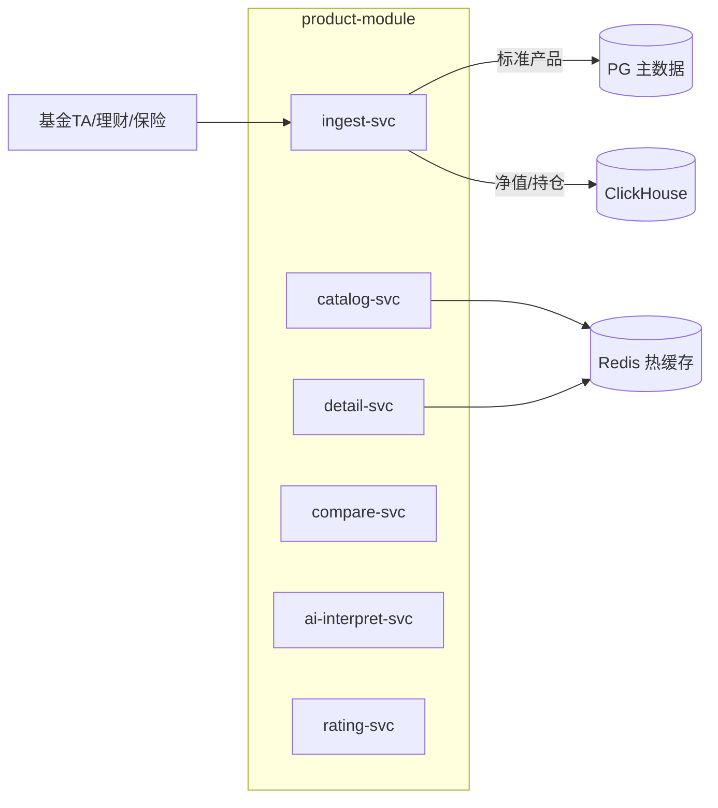
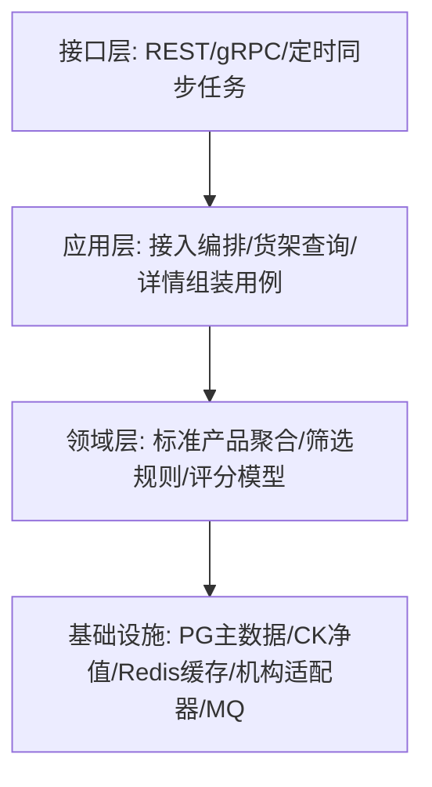
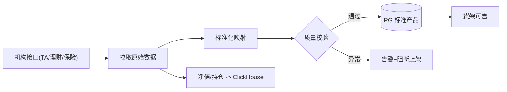
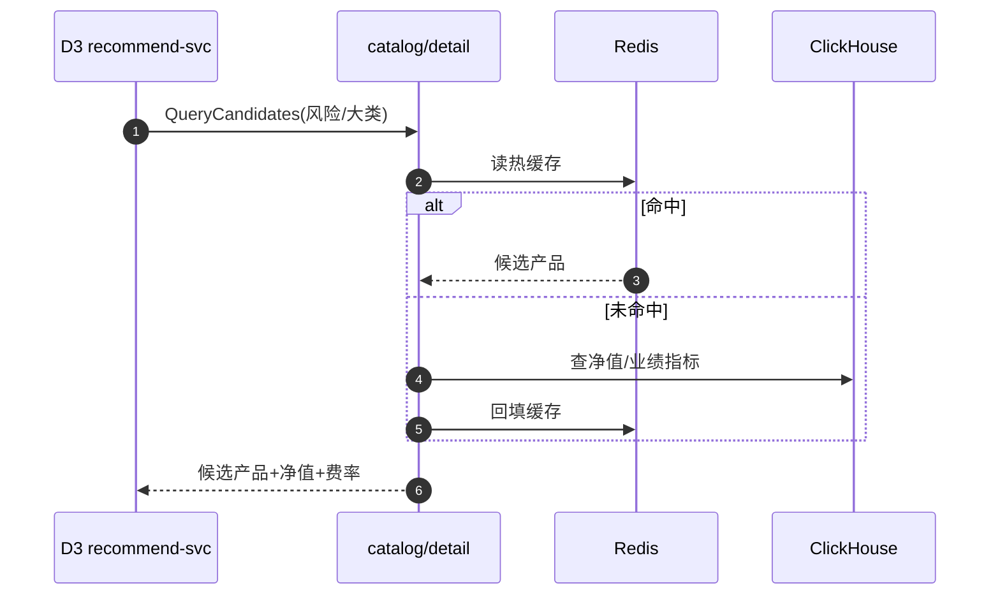

# D4 产品中心域 · 模块设计

> **文档编号**：ARCH-D4-PENSION-2026-001 · **版本**：V1 · **日期**：2026-07-03
> **上游**：《系统架构设计总览 V1》`00_系统架构设计总览V1.md`

---

## 1. 系统模块定义

| 项 | 内容 |
|----|------|
| 模块名 | `product-module`（产品中心域） |
| 限界上下文职责 | 多源产品接入与标准化、货架管理、详情、对比、AI 解读、评分 |
| 技术栈 | Java 17 + Spring Boot 3；PG（产品主数据）+ Redis（货架/详情热缓存）+ ClickHouse（净值序列/业绩） |
| 上游依赖 | 基金 TA、理财子、保险公司、行情数据源、S1 |
| 下游/协作 | 被 D3（候选产品/净值）、D5（下单校验）调用（gRPC） |
| 关键约束 | 关键合规字段准确率 100%、净值 T+1、风险提示合规展示 |
| 承载功能 | D4.1~D4.6 共 29 个功能 |

---

## 2. 系统组件定义

| 组件 | 职责 | 承载功能点 |
|------|------|-----------|
| `ingest-svc` 接入标准化 | 基金/理财/保险接入、净值/持仓同步、标准化映射、质量校验 | D4.1-F1~F7 |
| `catalog-svc` 货架管理 | 上下架、排序、多维筛选、推荐位、个性化排序 | D4.2-F1~F5 |
| `detail-svc` 产品详情 | 要素展示、业绩图表、持仓穿透、同类排名、风险提示 | D4.3-F1~F5 |
| `compare-svc` 产品对比 | 对比清单、曲线叠加、费率/风险对比、持有期模拟 | D4.4-F1~F5 |
| `ai-interpret-svc` AI 解读 | 通俗解读、问答、个性化适配 | D4.5-F1~F3 |
| `rating-svc` 评分 | 定量/定性/综合评分、展示 | D4.6-F1~F4 |

> MVP 交付 `ingest-svc`（基金+理财，单/少数机构）+ `catalog-svc`（列表/筛选）+ `detail-svc`（要素/业绩/风险提示）。`compare/ai/rating` 属 P1/P2。

---

## 3. 接口定义

### 3.1 对端 REST（经 BFF）

| 接口 | 方法 | 说明 |
|------|------|------|
| `/api/v1/products` | GET | 货架列表（筛选/排序/分页） |
| `/api/v1/products/{id}` | GET | 产品详情（要素/业绩/持仓/风险提示） |
| `/api/v1/products/compare` | POST | 2-4 只产品对比 |

### 3.2 域间同步（gRPC，被调用为主）

| RPC | 调用方 | 用途 |
|-----|--------|------|
| `Product.QueryCandidates` | D3 投顾 | 按大类/风险筛候选产品+净值+费率 |
| `Product.GetForTrade` | D5 交易 | 下单前产品状态/费率/风险等级校验 |
| `Product.BatchGetNav` | D3/D5 | 批量净值 |

### 3.3 事件（RocketMQ）

| 方向 | 事件 |
|------|------|
| 发布 | `product.NavUpdated`（净值更新）、`product.ShelfChanged`（上下架） |
| 订阅 | — （主数据驱动，少订阅） |

---

## 4. 分层设计

- **多源适配器模式**：每类机构（基金/理财/保险）一个适配器，统一映射到标准产品模型（D4.1-F6），新增机构不改上层。
- **读多写少**：货架/详情走 Redis 缓存 + CK 预聚合业绩指标，保证首屏 ≤1s。

---

## 5. 部署设计

| 项 | 方案 |
|----|------|
| 部署区 | 通用业务区，`ns: product` |
| 同步任务 | `ingest-svc` 用定时任务（净值 T+1、持仓 T+10 季报），失败告警重试 |
| 缓存 | 货架/详情多级缓存；净值序列查询走 ClickHouse 物化视图 |
| 数据质量 | 标准化后自动质量校验，异常阻断上架并告警 |

---

## 6. 进程设计

### 6.1 产品接入与标准化（批处理）

### 6.2 供投顾/交易的产品查询（被调用）

