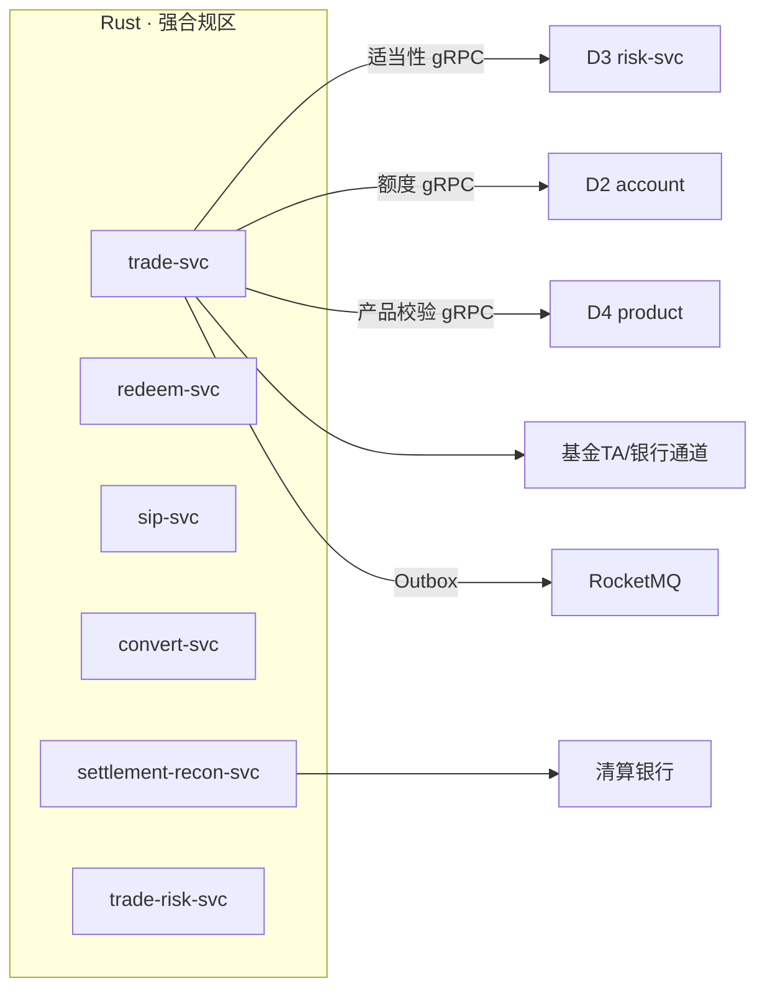
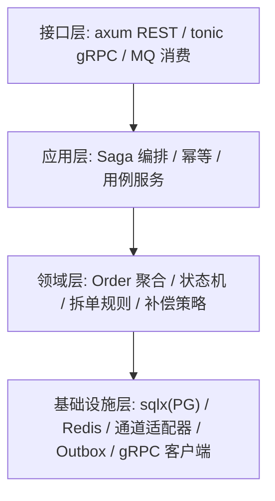
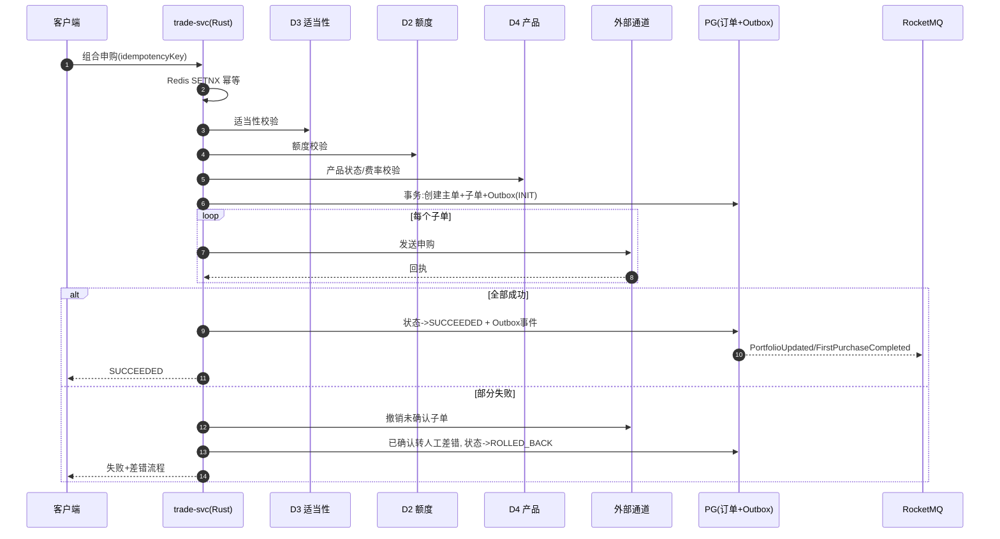
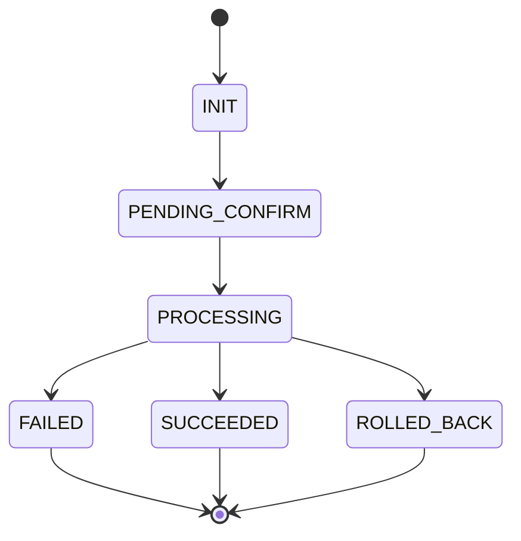
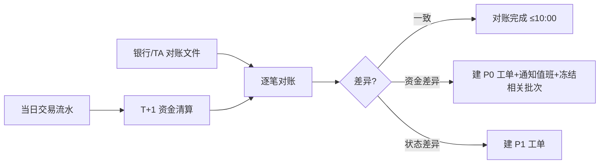

# D5 交易结算域 · 模块设计（Rust 高并发）

> **文档编号**：ARCH-D5-PENSION-2026-001 · **版本**：V1 · **日期**：2026-07-03
> **上游**：《系统架构设计总览 V1》`00_系统架构设计总览V1.md`
> 本域为**零容错金融核心 + 强合规隔离区**，采用 Rust 保证高并发、低时延与内存安全。

---

## 1. 系统模块定义

| 项 | 内容 |
|----|------|
| 模块名 | `trade-module`（交易结算域） |
| 限界上下文职责 | 申购/赎回/定投/转换、资金清算对账、交易风控 |
| 技术栈 | **Rust（axum + tokio + sqlx + tonic）**；PG（订单/资金强一致）+ Redis（幂等/分布式锁/限流） |
| 上游依赖 | D3（适当性校验 gRPC）、D2（额度校验 gRPC）、D4（产品校验 gRPC）、合作银行/基金 TA 通道 |
| 下游/协作 | 发布交易/持仓事件（Outbox → RocketMQ） |
| 关键约束 | 幂等、Saga 原子性（全成或全回滚）、状态机单向、T+1 对账、审计留痕、AML 协同 |
| 承载功能 | D5.1~D5.6 共 27 个功能 |

---

## 2. 系统组件定义

| 组件 | 职责 | 承载功能点 |
|------|------|-----------|
| `trade-svc` 交易服务 | 单笔/组合申购、拆单、Saga 编排、确认、大额验证、状态查询 | D5.1-F1~F6 |
| `redeem-svc` 赎回服务 | 部分/全部赎回、到账预估、冷静期、状态 | D5.2-F1~F5 |
| `sip-svc` 智能定投 | 定额/不定额/目标定投、计划管理、失败重试 | D5.3-F1~F5 |
| `convert-svc` 产品转换 | 资格校验、转换下单、状态 | D5.4-F1~F3 |
| `settlement-recon-svc` 清算对账 | T+1 清算、逐笔对账、差异告警、审计留痕 | D5.5-F1~F4 |
| `trade-risk-svc` 交易风控 | 异常识别、实时拦截、人工工单、规则管理 | D5.6-F1~F4 |

> MVP（Iteration-3）交付 `trade-svc`（组合一键申购 + Saga）+ `settlement-recon-svc`（T+1 对账 + 审计）+ `trade-risk-svc`（基础拦截）。定投/转换属 P1。



---

## 3. 接口定义

### 3.1 对端 REST（经 BFF）

| 接口 | 方法 | 说明 |
|------|------|------|
| `/api/v1/trades/portfolio-orders` | POST | 组合一键申购（幂等键，沿用 v1.1 契约） |
| `/api/v1/trades/orders/{id}` | GET | 交易状态查询 |
| `/api/v1/trades/redemptions` | POST | 赎回 |
| `/api/v1/trades/sip-plans` | POST | 定投计划 |

组合申购契约（沿用 v1.1 §4.2，错误码 `TR-4091/4221/5031`）：

```json
// POST  { "userId":"u_123","planId":"plan_c3_recommend","totalAmount":12000,"idempotencyKey":"9f56..." }
// 200   { "orderId":"po_10001","status":"PENDING_CONFIRM","subOrders":[{"productId":"fund_01","amount":4800}] }
```

### 3.2 域间同步（gRPC，调用方）

| RPC | 目标 | 依赖类型 |
|-----|------|----------|
| `Suitability.Check` | D3 | 控制（不通过则阻断） |
| `Account.CheckQuota` | D2 | 控制 |
| `Product.GetForTrade` | D4 | 控制 |

### 3.3 事件（Outbox → RocketMQ）

| 方向 | 事件 |
|------|------|
| 发布 | `trade.FirstPurchaseCompleted` / `trade.PortfolioUpdated` / `trade.RebalanceExecuted` |
| 订阅 | `advisor.RebalanceSuggestionGenerated`（用户确认后执行调仓） |

---

## 4. 分层设计（Rust 六边形）



- **领域层纯逻辑**：`Order`/`SubOrder` 聚合与状态机不依赖框架，便于单测。
- **幂等**：应用层入口用 Redis `SETNX(idempotency_key)` + PG 唯一约束双保险。
- **Saga**：应用层编排"创建主单→子单→通道→回执→事件"，失败触发补偿。
- **Outbox**：与订单写在同一 PG 本地事务，独立投递器异步发 RocketMQ，保证不丢事件。

---

## 5. 部署设计

| 项 | 方案 |
|----|------|
| 部署区 | **强合规隔离区** `node-pool-secure`（独立 VPC），`ns: trade` |
| 高并发 | Rust 服务多副本，tokio 异步；交易核心预留水位，不随普通业务缩容 |
| 削峰 | 下单入口前置队列/令牌桶限流；通道调用异步化 |
| 数据 | PG 交易库独立实例（跨 AZ 主从）；Redis 独立实例（幂等/锁） |
| 灰度 | P0 资金类告警自动暂停新增交易入口；备用通道热切换 |
| 审计 | 下单/撤单/补偿/差错全量写不可篡改审计流 |

---

## 6. 进程设计

### 6.1 组合一键申购 Saga（原子性 + 补偿）



### 6.2 订单状态机（单向流转）



### 6.3 T+1 清算对账


