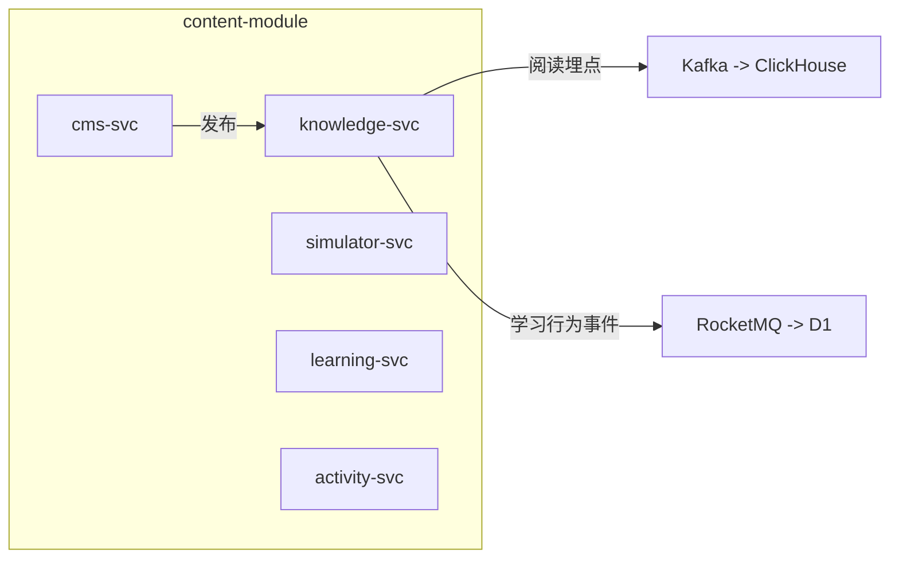
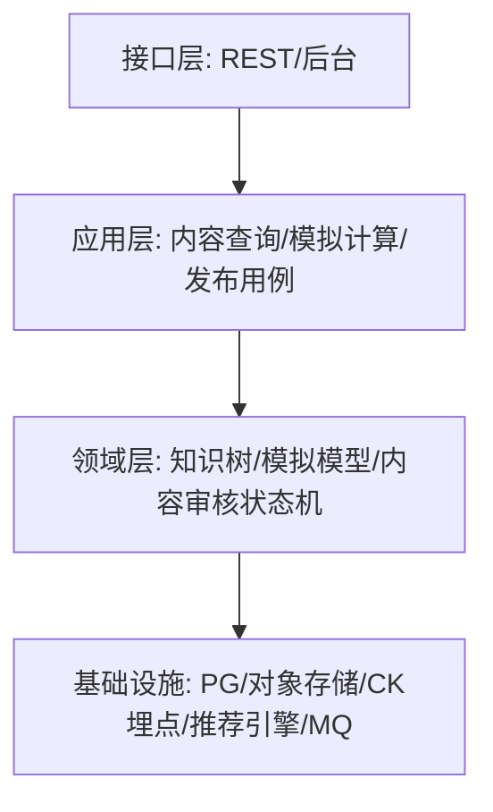
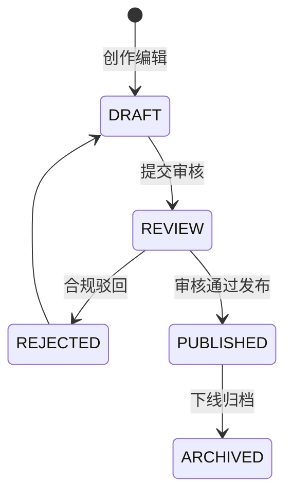
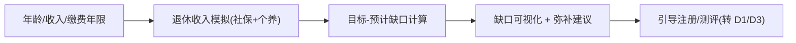

# D6 内容教育域 · 模块设计

> **文档编号**：ARCH-D6-PENSION-2026-001 · **版本**：V1 · **日期**：2026-07-03
> **上游**：《系统架构设计总览 V1》`00_系统架构设计总览V1.md`

---

## 1. 系统模块定义

| 项 | 内容 |
|----|------|
| 模块名 | `content-module`（内容教育域） |
| 限界上下文职责 | 养老金知识库、退休金模拟器、CMS、互动学习、活动运营 |
| 技术栈 | Java 17 + Spring Boot 3；PG（内容/进度）+ ClickHouse（阅读行为）+ 对象存储（图文/视频） |
| 上游依赖 | S1（阅读行为回流）、S2 |
| 下游/协作 | 向 D1 输出学习行为（丰富画像）；被 BFF 直接读取展示 |
| 关键约束 | 内容合规审核、客观中立不构成投资建议、模拟器假设条件明示 |
| 承载功能 | D6.1~D6.5 共 18 个功能 |

---

## 2. 系统组件定义

| 组件 | 职责 | 承载功能点 |
|------|------|-----------|
| `knowledge-svc` 知识库 | 分层内容组织、个性化推荐、阅读埋点 | D6.1-F1~F3 |
| `simulator-svc` 退休金模拟器 | 收入模拟、缺口可视化、场景对比、假设参数 | D6.2-F1~F4 |
| `cms-svc` 内容管理 | 创作编辑、审核发布、标签、版本 | D6.3-F1~F4 |
| `learning-svc` 互动学习 | 闯关、规划清单、进度记录 | D6.4-F1~F3 |
| `activity-svc` 活动运营 | 活动配置、签到任务、组合 PK、奖励结算 | D6.5-F1~F4 |

> MVP 交付 `knowledge-svc`（入门/产品百科 ≥20 篇）+ `simulator-svc`（退休收入+缺口）。互动/活动属 P2。



---

## 3. 接口定义

### 3.1 对端 REST（经 BFF）

| 接口 | 方法 | 说明 |
|------|------|------|
| `/api/v1/content/articles` | GET | 知识库列表（分层/推荐） |
| `/api/v1/content/articles/{id}` | GET | 文章详情 |
| `/api/v1/content/simulator/estimate` | POST | 退休收入模拟 + 缺口 |
| `/api/v1/content/cms/*` | * | 运营后台（受限） |

模拟器示例：

```json
// POST  { "age":30,"monthlyIncome":15000,"contributeYears":30 }
// 200   { "monthlyPension":6800,"targetIncome":10500,"gap":3700,"assumptions":{"inflation":0.02,"return":0.04} }
```

### 3.2 事件（RocketMQ / Kafka）

| 方向 | 事件 |
|------|------|
| 发布 | `content.ArticleRead`（Kafka 埋点）、`content.LearningBehavior`（RocketMQ → D1 画像） |
| 订阅 | — |

---

## 4. 分层设计



- **创作-审核-发布分离**（D6.3-F1/F2）在领域层用内容状态机表达，编辑权与合规审核权分立。
- 模拟器**假设参数可配置**（D6.2-F4），计算逻辑透明并在响应中回显假设。

---

## 5. 部署设计

| 项 | 方案 |
|----|------|
| 部署区 | 通用业务区，`ns: content` |
| 存储 | 图文/视频走对象存储 + CDN；正文与元数据 PG；阅读行为 ClickHouse |
| 缓存 | 热门内容 CDN + Redis；推荐结果短期缓存 |
| 弹性 | 读多写少，按读 QPS 扩容；活动期对 `activity-svc` 扩容 |

---

## 6. 进程设计

### 6.1 内容创作→审核→发布→推荐



### 6.2 退休金模拟（获客/教育工具）


