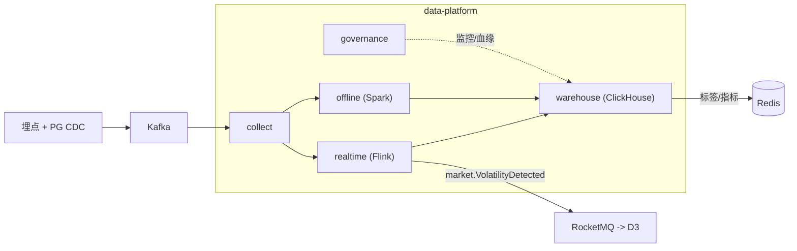
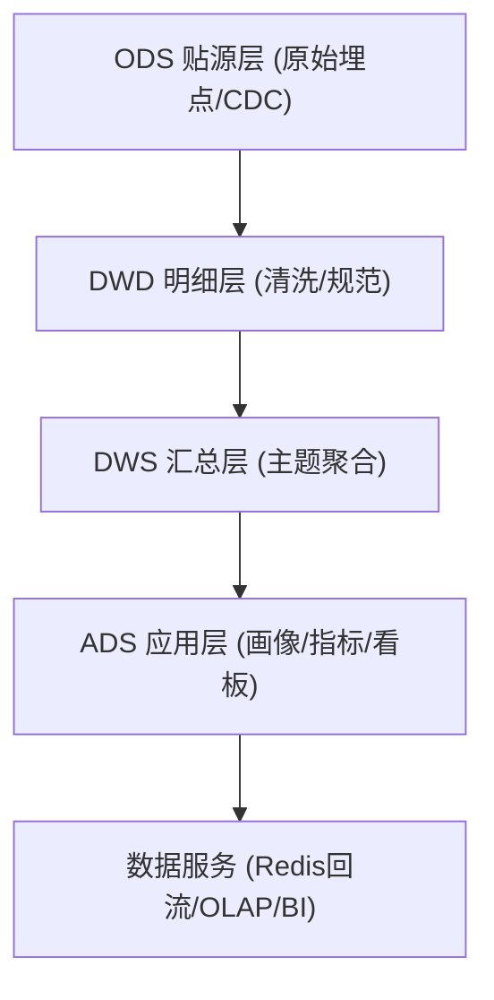
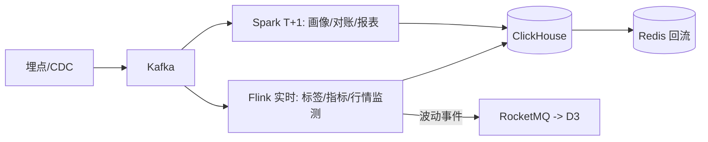
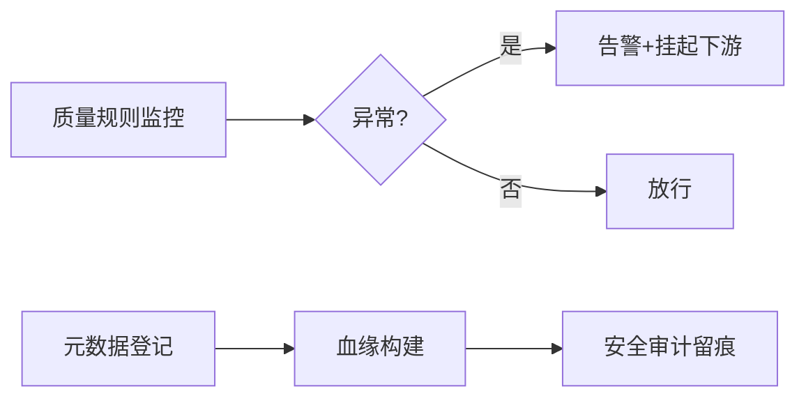

# S1 数据中台域 · 模块设计

> **文档编号**：ARCH-S1-PENSION-2026-001 · **版本**：V1 · **日期**：2026-07-03
> **上游**：《系统架构设计总览 V1》`00_系统架构设计总览V1.md`
> 支撑域：为所有业务域提供数据采集、计算、服务与治理能力。

---

## 1. 系统模块定义

| 项 | 内容 |
|----|------|
| 模块名 | `data-platform`（数据中台域） |
| 限界上下文职责 | 数据采集埋点、实时计算、离线计算、数据仓库、数据治理 |
| 技术栈 | 采集 SDK + Kafka；Flink（实时）；Spark（离线）；**ClickHouse**（数仓/OLAP）；调度(DolphinScheduler) |
| 上游依赖 | 各业务域埋点与 PG CDC |
| 下游/协作 | 画像/指标回流 Redis 供 D1/D3；BI 看板供运营；市场波动事件供 D3 |
| 关键约束 | 数据质量、血缘可追、数据安全审计、实时/离线口径一致 |
| 承载功能 | S1.1~S1.5 共 16 个功能 |

---

## 2. 系统组件定义

| 组件 | 职责 | 承载功能点 |
|------|------|-----------|
| `collect` 采集 | 多端埋点 SDK、上报接收、清洗 | S1.1-F1~F3 |
| `realtime` 实时计算 | Flink 流处理、实时标签、实时指标 | S1.2-F1~F3 |
| `offline` 离线计算 | Spark T+1 调度、画像批更、报表 | S1.3-F1~F3 |
| `warehouse` 数据仓库 | 分层建模、OLAP 查询、BI 服务 | S1.4-F1~F3 |
| `governance` 数据治理 | 质量监控、元数据、血缘、安全审计 | S1.5-F1~F4 |

---

## 3. 接口定义

### 3.1 数据服务接口

| 接口/能力 | 形式 | 说明 |
|-----------|------|------|
| 埋点上报 | HTTP/SDK | 统一事件字典 v1（业务域约定） |
| 标签/指标查询 | 回流 Redis + gRPC | 供 D1 精准营销、D3 画像读取 |
| OLAP 查询 | SQL/BI API | 运营看板、用户行为分析 |
| 市场波动事件 | RocketMQ 发布 | `market.VolatilityDetected` 触发 D3 再平衡 |

### 3.2 事件（发布）

| 事件 | 说明 |
|------|------|
| `market.VolatilityDetected` | 行情实时监测（日跌幅>3%）触发再平衡评估 |
| `data.ProfileUpdated` | 画像批量更新完成（供 D1 刷新受众） |

---

## 4. 分层设计（数据分层）

- **Lambda 架构**：实时(Flink)与离线(Spark)双链路，口径统一由 `governance` 校验。
- **回流机制**：ADS 层画像/指标秒级(实时)或 T+1(离线)回流 Redis，供在线低时延读取，不让在线系统直连 CK。

---

## 5. 部署设计

| 项 | 方案 |
|----|------|
| 部署区 | 数据平台区 `node-pool-data`，`ns: data-platform` |
| 资源 | Flink/Spark 独立算力池；ClickHouse 集群多分片多副本 |
| 隔离 | 分析负载与在线业务物理隔离，避免相互影响 |
| 安全 | 数据访问审计（S1.5-F4），加密委托 S2.4；敏感字段脱敏后入仓 |

---

## 6. 进程设计

### 6.1 采集→计算→服务（Lambda）

### 6.2 数据治理闭环

