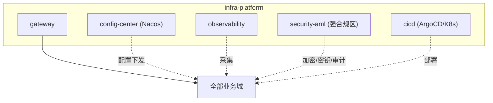
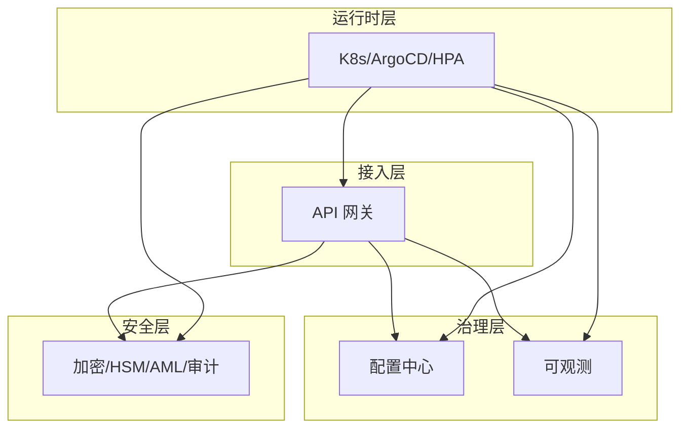
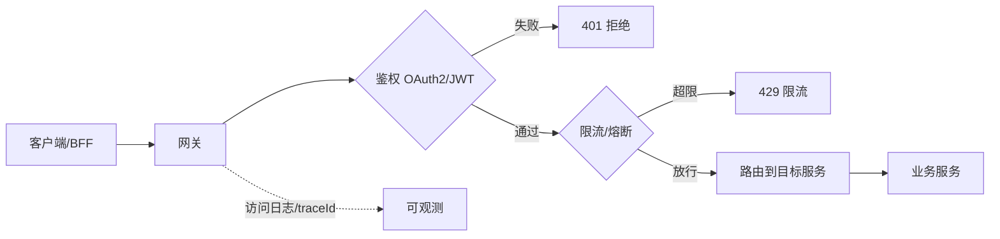
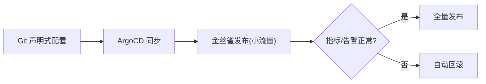
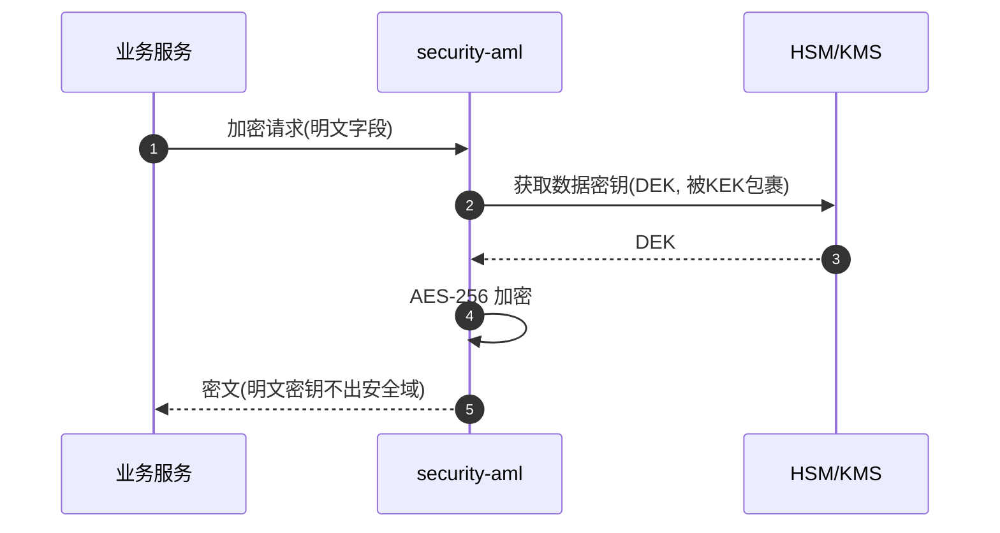

# S2 基础平台域 · 模块设计

> **文档编号**：ARCH-S2-PENSION-2026-001 · **版本**：V1 · **日期**：2026-07-03
> **上游**：《系统架构设计总览 V1》`00_系统架构设计总览V1.md`
> 支撑域：被所有域依赖（被依赖度最高），是稳定性/安全性/可扩展性的地基。

---

## 1. 系统模块定义

| 项 | 内容 |
|----|------|
| 模块名 | `infra-platform`（基础平台域） |
| 限界上下文职责 | API 网关、配置中心、监控告警、安全与合规基础设施、CI/CD 与容器编排 |
| 技术栈 | 网关(Spring Cloud Gateway/APISIX) + Nacos + Prometheus/Grafana/ELK/SkyWalking + HSM + K8s/ArgoCD |
| 上游依赖 | — |
| 下游/协作 | 为全部业务域与数据域提供基础能力 |
| 关键约束 | 高可用（单点即全局风险）、等保三级、密钥安全、AML |
| 承载功能 | S2.1~S2.5 共 22 个功能 |

---

## 2. 系统组件定义

| 组件 | 职责 | 承载功能点 |
|------|------|-----------|
| `gateway` API 网关 | 鉴权、限流、路由、访问日志 | S2.1-F1~F4 |
| `config-center` 配置中心 | 配置存储、热更新推送、版本回滚（Nacos） | S2.2-F1~F3 |
| `observability` 监控告警 | 指标采集、可视化、日志聚合、链路追踪、告警 | S2.3-F1~F5 |
| `security-aml` 安全合规 | 传输/存储加密、密钥管理(HSM)、AML、访问审计 | S2.4-F1~F5 |
| `cicd` 交付编排 | 流水线构建、部署、容器编排、弹性伸缩、灰度回滚 | S2.5-F1~F5 |

---

## 3. 接口定义

### 3.1 平台能力接口

| 能力 | 形式 | 说明 |
|------|------|------|
| 统一鉴权 | 网关过滤器 | OAuth2 + JWT 校验，下发用户上下文 |
| 限流/熔断 | 网关插件 + Sentinel | 全局与服务级双层 |
| 配置读取/订阅 | Nacos SDK | 热更新推送 |
| 加解密 | SDK/Sidecar | 字段级加密，密钥经 HSM，不暴露明文密钥 |
| 密钥管理 | KMS API | 密钥申请/轮转/销毁 |
| AML 监测 | 规则引擎 + 上报 | 可疑资金监测（区别于 D5.6 交易风控） |
| 指标/日志/链路 | Prometheus/ELK/SkyWalking | 统一 `traceId` 贯穿 |

---

## 4. 分层/架构设计

- **鉴权与限流分离**（S2.1-F1/F2）职责单一；路由不掺杂鉴权。
- **加解密执行与密钥托管分离**（S2.4-F2/F3），满足密钥最小暴露原则。
- **AML 与交易风控解耦**：AML 关注资金来源/洗钱模式，交易风控（D5.6）关注交易行为异常。

---

## 5. 部署设计

| 项 | 方案 |
|----|------|
| 网关 | 多副本 + 多 AZ，前置 LB；限流规则热更新 |
| 配置中心 | Nacos 集群（奇数节点），配置多环境隔离 |
| 可观测 | Prometheus 联邦 + 长存储；ELK 分索引权限隔离；SkyWalking OAP 集群 |
| 安全合规 | `security-aml` 部署于**强合规隔离区**；HSM 独立硬件/云 KMS |
| CI/CD | GitOps（ArgoCD），金丝雀发布 + 一键回滚，环境 dev/staging/gray/prod |
| 高可用 | 所有基础组件多副本无单点；网关/配置/密钥为最高可用等级 |

---

## 6. 进程设计

### 6.1 请求接入链路（鉴权→限流→路由→追踪）

### 6.2 GitOps 发布与灰度回滚

### 6.3 密钥管理与加密

