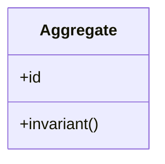
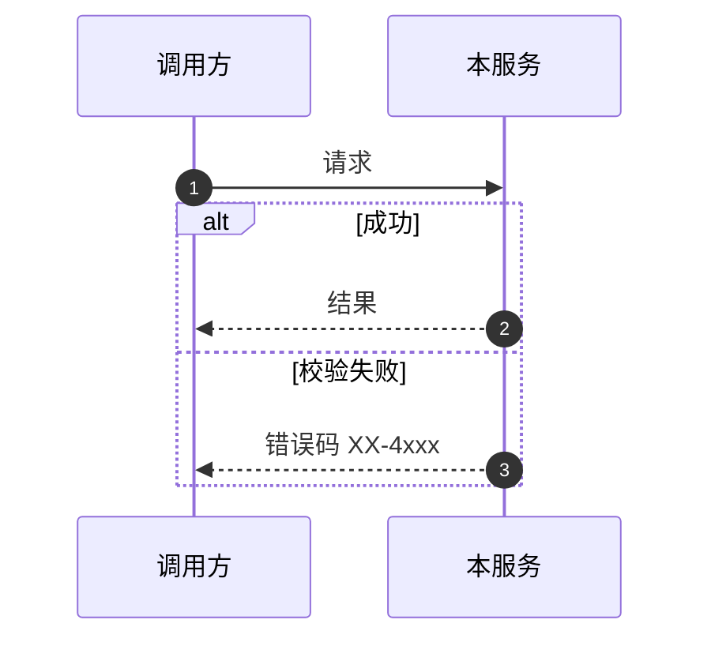
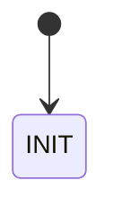

# <service> · 详细设计

> **文档编号**：DD-<域>-<服务>-<年>-<序号>
> **版本**：V1
> **日期**：YYYY-MM-DD
> **规范**：《详细设计规范 V1》(`docs/详细设计规范V1.md`) —— 10 章结构固定，空章写"不适用+原因"
> **上游**：架构 `docs/architecture/0X_*.md` · 功能点 `docs/个人养老金智能投顾平台_模块功能职责分解V1.md`
> **评审记录**：产品 __ / 研发 __ / 测试 __ / 合规 __（资金类必须）

---

## 1. 概述与范围

- **服务定位**：（一句话）
- **承载功能点**：`D?.?-F?` ~ `D?.?-F?`（逐项列表，含单一职责说明的引用）
- **非目标**：（本设计明确不覆盖的内容，防止范围蔓延）

## 2. 领域模型

- 聚合/实体/值对象清单与不变式（invariants）
- 领域事件（发布哪些，何时）

## 3. 接口设计

### 3.1 REST（对端）

| 接口 | 方法 | 幂等 | 说明 |
|------|------|------|------|
| `/api/v1/...` | POST | Idempotency-Key | |

（每个接口给出请求/响应 JSON 示例与字段表）

### 3.2 gRPC（域间）

| RPC | 方向 | 超时 | 可重试 | 契约文件 |
|-----|------|------|--------|----------|
| `Xxx.Yyy` | 调用/被调 | 800ms | 只读可 | `contracts/proto/...` |

### 3.3 领域事件

**发布**：

| 事件 | 触发时机 | payload schema |
|------|----------|----------------|

**订阅**：

| 事件 | 处理逻辑 | 失败策略（重试次数/死信/告警） |
|------|----------|-------------------------------|

## 4. 数据模型

- PG 表 DDL（含主键前缀、审计字段、加密列 `_enc/_hash`、唯一约束、索引及对应查询场景）
- Flyway 迁移编号：`V?__*.sql`
- Redis key 设计表：`pension:{domain}:{entity}:{id}` / TTL / 防护
- （如适用）ClickHouse 表与分层

## 5. 核心流程

（每个用例一张时序图，必须含 alt/else 异常路径：校验失败、下游超时、部分失败补偿）

（有状态实体给出单向状态机）

## 6. 错误码与异常处理

| 错误码 | 触发条件 | 用户文案（合规审核） | 系统动作 | 留痕 |
|--------|----------|----------------------|----------|------|
| `XX-4001` | | | | 是/否 |

## 7. 一致性设计

- **幂等**：Redis SETNX + PG 唯一约束（键：__）
- **事务边界**：（哪些操作在同一本地事务；事务内无远程调用）
- **Outbox**：（写哪些事件）
- **Saga**（跨服务写）：正向步骤表 + 补偿步骤表 + 不可补偿转人工界限
- **并发**：乐观锁 version / 条件更新 `WHERE status = :expected`

## 8. 缓存与性能

- SLO：P95 ≤ __ / P99 ≤ __；预估 QPS 日常 __ / 峰值 __
- 缓存表：key / TTL / 击穿・穿透・雪崩防护 / 与 DB 失效联动
- 降级行为：（每个含下游依赖的接口）

## 9. 安全与合规（逐项声明）

| 检查项 | 适用性 | 方案/原因 |
|--------|--------|-----------|
| SEC-01 PII 加密 | 适用/不适用 | |
| SEC-02 鉴权与越权 | | |
| SEC-03 审计留痕 | | |
| SEC-04 适当性校验 | | |
| SEC-05 合规文案 | | |
| SEC-06 PIPL 最小采集 | | |
| SEC-07 AML 口径 | | |
| SEC-08 二次验证 | | |
| SEC-09 日志脱敏 | | |

## 10. 可观测与测试

- **指标**：`pension_<domain>_<subject>_<unit>` 列表 + 三类告警（可用性/时延/业务）
- **日志**：关键动作与字段
- **测试矩阵**：

| 类型 | 用例要点 | 覆盖目标 |
|------|----------|----------|
| 单元 | 领域规则清单 | 分支 ≥ 80% |
| 集成 | 契约正例+反例（Testcontainers） | 契约 100% |
| E2E | 参与的主链路与断言点 | 主路径+关键异常 |
| 高风险 | （资金/合规类引用 v1.1 §8.2） | 必须自动化 |

---

### DoD 自查（提交评审前勾选）

- [ ] 10 章齐全，功能点回链无遗漏
- [ ] 契约已同步 `contracts/proto` 与错误码目录
- [ ] mermaid 全部可渲染且含异常路径
- [ ] DDL 符合规范（主键/审计/加密/索引/迁移）
- [ ] 幂等/事务/Saga/Outbox 四问有答案
- [ ] 安全合规清单逐项声明
- [ ] 指标与测试矩阵可直接转任务
