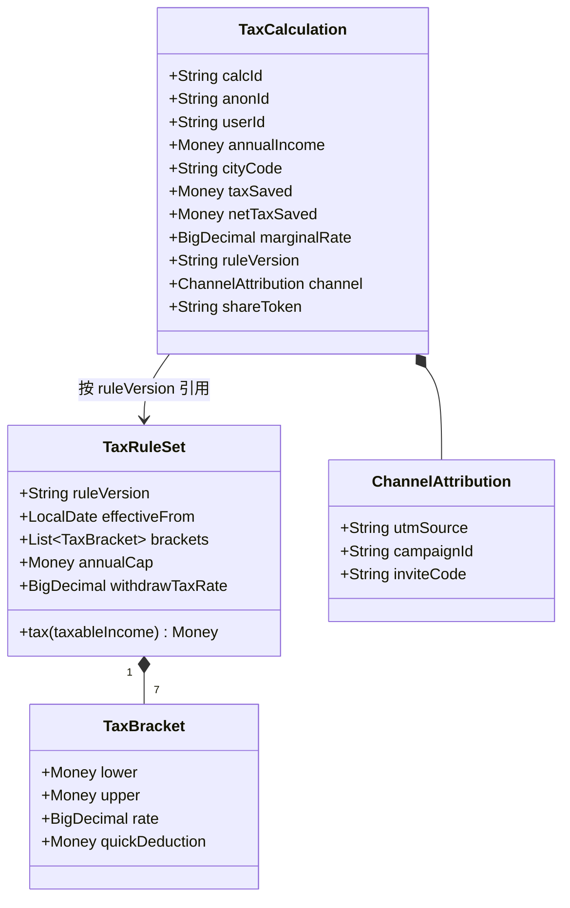
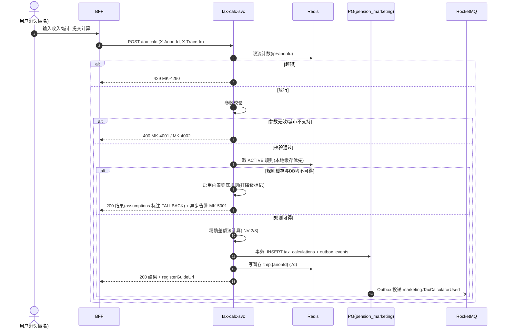
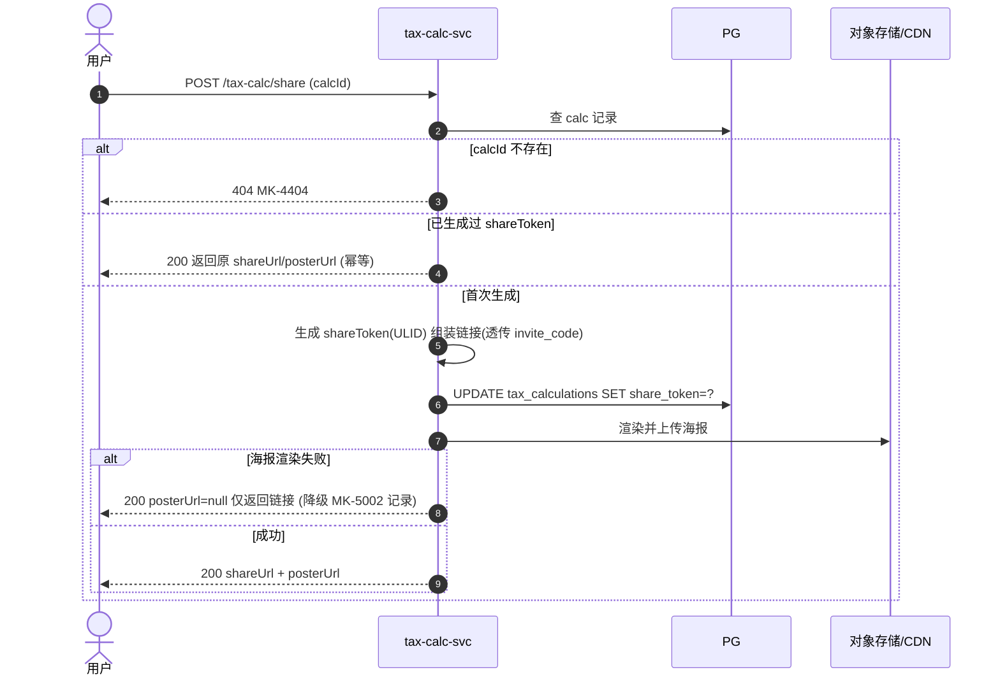
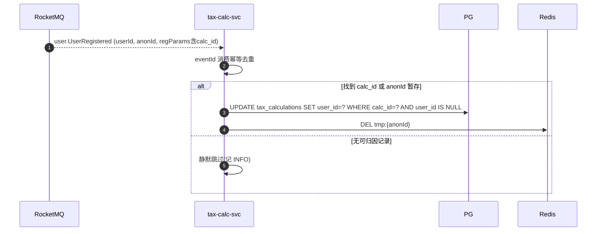

# tax-calc-svc · 详细设计

> **文档编号**：DD-D1-TAXCALC-2026-001
> **版本**：V1
> **日期**：2026-07-03
> **规范**：《详细设计规范 V1》(`docs/详细设计规范V1.md`)
> **上游**：架构 `docs/architecture/01_营销获客域_模块设计V1.md` · 功能点 `D1.6-F1~F6` · v1.1 §2.2 链路 A / §3.1 Iteration-1
> **评审记录**：产品 __ / 研发 __ / 测试 __ / 合规 __（涉税务口径文案，合规必须评审第 6/9 章）

---

## 1. 概述与范围

### 1.1 服务定位

D1 营销获客域的**核心获客入口**：用户输入收入即可算出个人养老金年度节税金额，支持 H5 独立传播与分享裂变，计算完成后引导注册（v1.1 链路 A：`H5税优计算器 -> 注册引导 -> 渠道归因`）。

### 1.2 承载功能点（对照职责分解 V1）

| 功能点 | 名称 | 单一职责边界 | 本版 |
|--------|------|--------------|------|
| D1.6-F1 | 税优金额计算 | 只负责按官方税率公式计算年度节税额；不负责页面渲染 | ✅ |
| D1.6-F2 | H5 页面渲染 | 只负责计算器 H5 的展示与交互；不负责计算逻辑（前端实现，本设计给出其依赖的接口契约） | ✅ |
| D1.6-F3 | 分享物料生成 | 只负责生成分享海报/链接；不负责邀请码逻辑 | ✅ |
| D1.6-F4 | 邀请码携带与解析 | 只负责在分享链路中写入/解析邀请码；不负责关系绑定（委托 D1.5） | ✅ |
| D1.6-F5 | 注册引导跳转 | 只负责在计算完成后引导用户进入注册；不负责注册本身 | ✅ |
| D1.6-F6 | 计算记录暂存 | 只负责临时保存未注册用户的计算结果；不负责持久化画像 | ✅ |

### 1.3 非目标

- **不做**用户注册/实名（D2 user-service 职责，本服务仅生成带归因参数的引导链接）
- **不做**邀请关系绑定与发奖（D1.5 referral-svc 职责，本服务只透传/解析 `invite_code`）
- **不做**用户画像标签写入（D1.1 profile-svc 订阅本服务事件后自行处理）
- **不做**个税申报级的精确报税计算（本服务输出为**营销测算**，展示假设条件与免责声明）
- 组队/排行等裂变玩法（v1.1 明确 MVP 暂不交付）

### 1.4 与架构文档的偏差声明

架构 01 §3.2 曾列 `Registration.Guide` gRPC（→ D2）。详细设计将其修正为**前端跳转 + URL 归因参数**方案（注册引导本质是页面导航，无需服务间同步调用），减少一条跨域依赖。偏差已在本文档 §3.2 说明，架构文档下一版同步更新。

---

## 2. 领域模型



### 2.1 不变式（invariants）

| 编号 | 不变式 |
|------|--------|
| INV-1 | 所有金额为 `Money`（Decimal 18,2），计算中间量 `numeric(18,4)`，最终结果四舍五入到分 |
| INV-2 | `taxSaved = tax(应纳税所得额) − tax(应纳税所得额 − min(缴费, 12000))`，**精确分段差额法**（保证跨档场景误差 ≤ 1 元，不用单一边际税率近似） |
| INV-3 | `netTaxSaved = taxSaved − 12000 × withdrawTaxRate(3%)`，可为负（低收入档），负值时前端展示"税优不适用"话术 |
| INV-4 | 每条 `TaxCalculation` 必须绑定生成时的 `ruleVersion`（结果可复现、可审计） |
| INV-5 | `shareToken` 全局唯一且不可枚举（ULID + 混淆） |
| INV-6 | 同一 `TaxRuleSet` 的 brackets 必须连续覆盖 `[0, +∞)` 且税率单调不减（规则加载时校验，违反则拒绝启用） |

### 2.2 计算算法（D1.6-F1，权威定义）

```
输入: annualIncome(税前年收入), cityCode, 可选 sifCustom(自报社保公积金年缴), deductions(专项附加扣除, 默认 0)
1. sif  = sifCustom ?? estimateSif(cityCode, annualIncome)     -- 按城市社保基数上下限估算五险一金
2. taxable  = max(0, annualIncome − 60000 − sif − deductions)  -- 应纳税所得额
3. taxSaved = tax(taxable) − tax(max(0, taxable − 12000))      -- 精确差额法
4. marginalRate = bracketOf(taxable).rate                       -- 仅用于展示
5. netTaxSaved  = taxSaved − 12000 × 3%
输出: taxSaved / netTaxSaved / marginalRate / assumptions(sif 估算口径, ruleVersion)
```

- 税率表（2026 现行综合所得年度税率）与城市社保基数表均为 `TaxRuleSet` 配置数据，**不写死在代码**；规则版本化，新版本经合规审核后按 `effectiveFrom` 生效。
- 验收基线：与官方公式黄金用例表比对**误差 ≤ 1 元**（v1.1 Iteration-1 门禁、D1-AC-01）。

### 2.3 领域事件

| 事件 | 触发时机 |
|------|----------|
| `marketing.TaxCalculatorUsed` | 每次计算成功后（Outbox） |

---

## 3. 接口设计

### 3.1 REST（经 BFF/网关；计算与分享接口**支持匿名**）

| 接口 | 方法 | 幂等 | 鉴权 | 说明 |
|------|------|------|------|------|
| `/api/v1/marketing/tax-calc` | POST | 天然幂等（纯计算+暂存） | 匿名（限流） | 税优计算 |
| `/api/v1/marketing/tax-calc/share` | POST | 按 `calcId` 幂等 | 匿名（限流） | 生成分享物料 |
| `/api/v1/marketing/tax-calc/shares/{shareToken}` | GET | 只读 | 匿名 | 分享回显（H5 落地页数据） |
| `/api/v1/marketing/tax-calc/rules/current` | GET | 只读 | 匿名 | 当前规则版本与假设条件（前端展示合规披露用） |

#### 3.1.1 税优计算

```json
// POST /api/v1/marketing/tax-calc
// Header: X-Trace-Id: tr_xxx  (匿名场景由 BFF 生成 anonId cookie 透传: X-Anon-Id)
{
  "annualIncome": "300000.00",
  "cityCode": "310100",
  "deductions": "24000.00",
  "sifCustom": null,
  "channel": { "utmSource": "douyin", "campaignId": "c_202607_tax", "inviteCode": "INV8K3D" }
}
// 200
{
  "calcId": "tc_01J9ZKQ8...",
  "taxSaved": "2400.00",
  "netTaxSaved": "2040.00",
  "marginalRate": "0.20",
  "annualCap": "12000.00",
  "assumptions": {
    "ruleVersion": "iit-2026a",
    "sifEstimated": "37440.00",
    "sifMethod": "CITY_BASE_ESTIMATE",
    "disclaimer": "测算结果仅供参考，不构成税务建议"
  },
  "registerGuideUrl": "/register?src=taxcalc&calc_id=tc_01J9ZKQ8&utm_source=douyin&campaign_id=c_202607_tax&invite_code=INV8K3D"
}
```

字段约束：`annualIncome ∈ ["0.01","99999999.99"]`；`cityCode` 为 6 位行政区划码且在支持列表内；`deductions ≥ 0`；金额一律字符串（规范 §3.1）。

#### 3.1.2 生成分享物料

```json
// POST /api/v1/marketing/tax-calc/share
{ "calcId": "tc_01J9ZKQ8...", "style": "POSTER_A" }
// 200
{
  "shareToken": "sh_9m2KpX",
  "shareUrl": "https://h5.pensionsmart.cn/tax?st=sh_9m2KpX&invite_code=INV8K3D",
  "posterUrl": "https://cdn.pensionsmart.cn/poster/sh_9m2KpX.png"   // 渲染失败时为 null, 见 MK-5002 降级
}
```

#### 3.1.3 分享回显（H5 落地页）

```json
// GET /api/v1/marketing/tax-calc/shares/sh_9m2KpX
// 200: 返回脱敏结果(taxSavedBand 而非精确收入) + inviteCode + 注册引导链接
{
  "taxSavedBand": "2000-3000",
  "inviteCode": "INV8K3D",
  "registerGuideUrl": "/register?src=taxshare&st=sh_9m2KpX&invite_code=INV8K3D",
  "calcEntryUrl": "/tax-calc?invite_code=INV8K3D"
}
```

> 回显**不返回原始收入与精确节税额**（他人可见页面，隐私保护，见 §9 SEC-06）。

### 3.2 gRPC（域间）

| RPC | 方向 | 结论 |
|-----|------|------|
| `Registration.Guide`（架构 01 原设计） | → D2 | **不适用**：注册引导为前端跳转 + URL 归因参数（§1.4 偏差声明），无服务间调用 |
| 本服务对外提供 | — | 无（获客工具，不被其他域同步依赖） |

### 3.3 领域事件

**发布（Outbox → RocketMQ topic `{env}_marketing_events`）：**

| 事件 | 触发时机 | payload schema |
|------|----------|----------------|
| `marketing.TaxCalculatorUsed` | 计算成功、事务提交后投递 | `{ "calcId", "anonId", "userId"(可空), "taxSavedBand", "marginalRate", "cityCode", "channel": {"utmSource","campaignId","inviteCode"}, "registered": false }` |

- payload 用 `taxSavedBand`（区间）而非精确金额，供 D1 画像/触达使用即可，最小化数据暴露。
- 订阅方（本设计仅登记，不设计其实现）：`reach-svc`（未注册 30 分钟提醒，链路三）、`profile-svc`（兴趣标签）。

**订阅：**

| 事件 | 处理逻辑 | 失败策略 |
|------|----------|----------|
| `user.UserRegistered` | 按 `anonId`/`calc_id` 归因参数将暂存计算记录关联到 `userId`（D1.6-F6 归档） | 重试 3 次（指数退避）→ 死信 + P2 告警；漏关联不影响主流程 |

---

## 4. 数据模型

### 4.1 PostgreSQL（库 `pension_marketing`，Flyway 于 `services/marketing/tax-calc-svc/src/main/resources/db/migration/`）

```sql
-- V1__create_tax_rule_sets.sql
CREATE TABLE tax_rule_sets (
    rule_version   varchar(32)  PRIMARY KEY,          -- 如 iit-2026a
    effective_from date         NOT NULL,
    brackets       jsonb        NOT NULL,             -- 七档税率表 [{lower,upper,rate,quickDeduction}]
    city_sif_bases jsonb        NOT NULL,             -- 城市社保基数上下限与费率
    annual_cap     numeric(18,2) NOT NULL DEFAULT 12000.00,
    withdraw_rate  numeric(10,6) NOT NULL DEFAULT 0.03,
    status         varchar(16)  NOT NULL,             -- DRAFT/ACTIVE/RETIRED
    created_at     timestamptz  NOT NULL DEFAULT now(),
    updated_at     timestamptz  NOT NULL DEFAULT now(),
    CONSTRAINT ck_tax_rule_sets_status CHECK (status IN ('DRAFT','ACTIVE','RETIRED'))
);

-- V2__create_tax_calculations.sql
CREATE TABLE tax_calculations (
    calc_id        varchar(32)  PRIMARY KEY,          -- tc_ 前缀 ULID
    anon_id        varchar(64),                       -- 匿名设备标识(BFF 下发)
    user_id        varchar(32),                       -- 注册归因后回填
    annual_income  numeric(18,2) NOT NULL,            -- 敏感: 日志禁出现, 见 SEC-09
    city_code      varchar(6)   NOT NULL,
    deductions     numeric(18,2) NOT NULL DEFAULT 0,
    sif_amount     numeric(18,2) NOT NULL,
    tax_saved      numeric(18,2) NOT NULL,
    net_tax_saved  numeric(18,2) NOT NULL,
    marginal_rate  numeric(10,6) NOT NULL,
    rule_version   varchar(32)  NOT NULL,
    utm_source     varchar(64),
    campaign_id    varchar(64),
    invite_code    varchar(32),
    share_token    varchar(32),
    created_at     timestamptz  NOT NULL DEFAULT now(),
    updated_at     timestamptz  NOT NULL DEFAULT now(),
    CONSTRAINT uq_tax_calculations_share UNIQUE (share_token)
);
CREATE INDEX idx_tax_calculations_anon    ON tax_calculations (anon_id, created_at DESC);
CREATE INDEX idx_tax_calculations_user    ON tax_calculations (user_id) WHERE user_id IS NOT NULL;
CREATE INDEX idx_tax_calculations_invite  ON tax_calculations (invite_code) WHERE invite_code IS NOT NULL;

-- V3__create_outbox.sql  (规范 §7 Outbox 模式)
CREATE TABLE outbox_events (
    event_id     varchar(64)  PRIMARY KEY,
    event_type   varchar(128) NOT NULL,
    payload      jsonb        NOT NULL,
    trace_id     varchar(64)  NOT NULL,
    status       varchar(16)  NOT NULL DEFAULT 'PENDING',  -- PENDING/SENT
    created_at   timestamptz  NOT NULL DEFAULT now(),
    sent_at      timestamptz
);
CREATE INDEX idx_outbox_pending ON outbox_events (created_at) WHERE status = 'PENDING';
```

索引与查询场景对应：`anon_id`（未注册用户回显最近计算）、`user_id`（注册归因回填）、`invite_code`（裂变归因统计，供 D1.5 离线取数）、`share_token` 唯一（分享回显）。

### 4.2 Redis（规范 §4.3）

| Key | 类型 | TTL | 用途 |
|-----|------|-----|------|
| `pension:marketing:taxcalc:rules:current` | String(JSON) | 10min + 逻辑过期 | ACTIVE 规则缓存（另有 Caffeine 本地二级缓存 60s） |
| `pension:marketing:taxcalc:share:{shareToken}` | String(JSON) | 30d | 分享回显热缓存（脱敏后数据） |
| `pension:marketing:taxcalc:tmp:{anonId}` | String(JSON) | 7d | D1.6-F6 未注册暂存（最近一次计算，注册归档后删除） |
| `pension:marketing:taxcalc:rl:{ip}` | INCR | 60s | 限流计数（IP 维度 30 次/分钟） |
| `pension:marketing:taxcalc:rl:anon:{anonId}` | INCR | 60s | 限流计数（设备维度 10 次/分钟） |

### 4.3 ClickHouse

不建表。计算/分享行为经埋点事件（`tax_calc_used` 等，见 data-platform 事件字典）入仓，本服务不直写 CK（规范 §4.2）。

---

## 5. 核心流程

### 5.1 用例一：税优计算（含暂存、事件、注册引导）



> DB 写入失败时：计算结果仍返回给用户（**计算可用性优先于记录完整性**），暂存/事件丢失记 ERROR 日志 + P2 告警，不阻断用户。

### 5.2 用例二：生成分享物料（D1.6-F3/F4）



### 5.3 用例三：注册归因回填（订阅 `user.UserRegistered`）



### 5.4 状态机

**不适用**：`TaxCalculation` 为一次性记录，无状态流转（唯一的字段演进是 `user_id`/`share_token` 从 NULL 到有值，且只允许 NULL→值 单向回填，用条件更新 `WHERE ... IS NULL` 保证）。

### 5.5 定时任务

| 任务 | 周期 | 幂等性 | 说明 |
|------|------|--------|------|
| 规则生效切换 | 每日 00:05 | 重跑安全（按 effective_from 幂等激活） | `DRAFT→ACTIVE`、旧版 `ACTIVE→RETIRED`；切换后主动失效 Redis/本地缓存 |
| Outbox 补偿投递 | 30s | 按 event_id 幂等 | 扫 `PENDING` 超过 1min 的事件重投 |
| 暂存清理 | 每日 03:00 | 重跑安全 | 删除 90 天前且未归因（user_id IS NULL）的计算记录（PIPL 最小保留） |

---

## 6. 错误码与异常处理

| 错误码 | 触发条件 | 用户文案（待合规审核） | 系统动作 | 留痕 |
|--------|----------|------------------------|----------|------|
| `MK-4001` | 参数无效（收入超界/格式错） | 请输入有效的年收入金额 | 拒绝，无副作用 | 否 |
| `MK-4002` | cityCode 不在支持列表 | 该城市暂未支持，已按全国口径估算 | 可选：回退全国默认基数并标注 assumptions（前端决定） | 否 |
| `MK-4290` | 触发限流（IP 30/min 或设备 10/min） | 操作太频繁，请稍后再试 | 拒绝；连续触发 5 次升级 P2 告警（防刷） | 否 |
| `MK-4404` | 分享 calcId/shareToken 不存在或已清理 | 分享内容已过期，来算算你的节税额吧 | 引导到计算入口 | 否 |
| `MK-5001` | 规则加载失败（DB+缓存均不可用） | （不面向用户，静默降级） | 启用内置兜底规则，结果标注 FALLBACK；P1 告警 | 是（降级记录） |
| `MK-5002` | 海报渲染/上传失败 | 海报生成失败，可直接复制链接分享 | 降级返回纯链接；重试 1 次；P2 告警 | 否 |
| `MK-5003` | 暂存/事件写入失败（计算已成功） | （不面向用户） | 返回计算结果；ERROR 日志 + P2 告警 | 是 |

重试策略：本服务所有写操作幂等（§7），Outbox 补偿任务兜底事件投递；对外无非幂等写，无自动重试禁区。

---

## 7. 一致性设计

| 四问 | 答案 |
|------|------|
| **幂等键** | 计算：无需幂等键（纯函数 + 追加式记录，重复提交生成新记录属预期）；分享：按 `calc_id` 幂等（share_token 已存在即返回原值）；归因回填：条件更新 `WHERE user_id IS NULL`；事件消费：`eventId` 去重表 |
| **事务边界** | `INSERT tax_calculations` + `INSERT outbox_events` 同一 PG 本地事务；**事务内无远程调用**（Redis 暂存与海报上传均在事务提交后执行） |
| **Outbox 事件** | `marketing.TaxCalculatorUsed`（唯一出站事件），独立投递器 30s 补偿 |
| **Saga** | **不适用**：无跨服务写操作（本服务不调用任何下游写接口） |

并发控制：`share_token` 生成用 `UPDATE ... WHERE share_token IS NULL` 条件更新，影响行数 0 则读取已有值返回（双击并发安全）。

---

## 8. 缓存与性能

### 8.1 SLO 与容量

| 指标 | 目标 | 依据 |
|------|------|------|
| 计算接口 | P95 ≤ 200ms / P99 ≤ 500ms（服务端） | D1-AC-01 要求端到端 <1s 展示 |
| 分享回显 | P95 ≤ 100ms（Redis 命中） | H5 落地页首屏 ≤ 2s（D1-AC-02）的服务端预算 |
| QPS 估算 | 日常 ~50；**营销峰值 2,000+**（投放/裂变传播场景） | 获客入口具突发性 |
| 数据量 | 计算记录 ~500 万条/年（峰值月 100 万） | 单表可支撑，两年后评估分区 |

### 8.2 缓存与防护

- 规则缓存双层：Caffeine(60s) → Redis(10min 逻辑过期) → PG；逻辑过期 + 单飞重建防击穿。
- 分享回显：Redis 30d；miss 回源 PG 并回填；不存在的 token 写 60s 空值缓存防穿透。
- 限流双维度（IP + anonId）在入口执行，网关层另有全局限流兜底。
- TTL 加 ±10% 随机抖动防雪崩。

### 8.3 降级行为（每个下游依赖）

| 依赖 | 故障时行为 |
|------|-----------|
| PG | 计算仍可用（规则走缓存/内置兜底），记录与事件丢失记警（MK-5003） |
| Redis | 限流退化为本地令牌桶；暂存跳过；规则走本地缓存/DB |
| 对象存储 | 海报降级为纯链接（MK-5002） |
| RocketMQ | Outbox 积压，补偿任务持续重投，不影响用户 |

---

## 9. 安全与合规（逐项声明）

| 检查项 | 适用性 | 方案/原因 |
|--------|--------|-----------|
| SEC-01 PII 加密 | **不适用** | 本服务不采集姓名/证件/手机号；`annual_income` 属敏感财务数据但非 PII，明文存储 + 访问权限收敛 + 日志禁出（见 SEC-09）；`anon_id` 为不可逆设备散列 |
| SEC-02 鉴权与越权 | 适用 | 计算/分享匿名开放（限流防刷）；分享回显仅返回脱敏 band 数据；`calcId` 不可枚举（ULID），且 share 接口不回显收入原值 |
| SEC-03 审计留痕 | 适用（弱） | 非资金操作；降级事件（MK-5001/5003）与规则版本切换写审计日志；计算记录本身含 ruleVersion 可复现 |
| SEC-04 适当性校验 | 不适用 | 无交易行为 |
| SEC-05 合规文案 | **适用（重点）** | 结果页必须展示：假设条件（sif 估算口径/规则版本）+"测算仅供参考，不构成税务建议"；禁止"保证节税 XX 元"绝对化表述；文案 key 集中管理，合规审核后发布 |
| SEC-06 PIPL 最小采集 | **适用（重点）** | 匿名可用（不强制注册）；只采集计算必需字段；回显页脱敏；未归因记录 90 天清理（§5.5）；隐私政策链接在 H5 页脚 |
| SEC-07 AML | 不适用 | 无资金流 |
| SEC-08 二次验证 | 不适用 | 无交易 |
| SEC-09 日志脱敏 | 适用 | `annual_income/deductions/sif` 禁止入日志，日志仅记 `taxSavedBand`；anonId 打码保留后 4 位 |

---

## 10. 可观测与测试

### 10.1 指标（Prometheus）

| 指标 | 类型 | 说明 |
|------|------|------|
| `pension_marketing_taxcalc_calc_total{result,fallback}` | counter | 计算次数（成功/失败/是否降级） |
| `pension_marketing_taxcalc_calc_duration_seconds` | histogram | 计算时延（P95 告警阈 300ms） |
| `pension_marketing_taxcalc_share_total{poster}` | counter | 分享生成（含海报成败） |
| `pension_marketing_taxcalc_guide_exposure_total` | counter | 注册引导曝光（D1.6-F4 验收：曝光率 100%） |
| `pension_marketing_taxcalc_ratelimit_total{dim}` | counter | 限流触发（防刷监测） |
| `pension_marketing_taxcalc_outbox_pending` | gauge | Outbox 积压（>100 P2 告警） |

告警三类：可用性（5xx 错误率 >1% P1）、时延（P95>300ms 持续 5min P2）、业务（fallback 规则启用即 P1；outbox 积压 P2）。

### 10.2 日志

关键动作结构化字段：`traceId / anonId(打码) / action(CALC|SHARE|ATTRIBUTE) / result / costMs / ruleVersion / taxSavedBand`。ERROR 级仅用于需人工介入场景（MK-5001/5003）。

### 10.3 测试矩阵

| 类型 | 用例要点 | 覆盖目标 |
|------|----------|----------|
| 单元 | **黄金用例表**：7 个税率档位边界 ±1 元、跨档差额法（如 taxable=147000 跨 20%/10% 档）、taxable<0、netTaxSaved<0、sif 城市上下限截断、INV-6 规则校验拒绝 | 领域层分支 ≥ 80%；**与官方公式比对误差 ≤ 1 元逐例断言** |
| 集成 | 4 个 REST 接口正例+反例（400/404/429）；Outbox 事务原子性（计算插入与事件同回滚）；归因条件更新并发（两次 UserRegistered 只回填一次）；Testcontainers 起 PG+Redis | 契约 100% |
| E2E | 链路 A：H5 计算 → 分享 → 落地页回显 → 注册引导跳转（断言归因参数完整透传） | 主路径 + MK-4290/MK-5002 异常路径 |
| 性能 | 计算接口 2,000 QPS 压测（规则全缓存命中），P95 ≤ 200ms | 峰值容量 |
| 高风险 | 规则版本切换瞬间的计算一致性（老请求用老版本）；防刷（脚本批量调用触发限流+告警） | 必须自动化 |

验收口径（对齐 v1.1 §7.1）：统计窗口自然日，样本 n ≥ 1,000 次真实计算；误差断言用黄金用例表（n=40 例，覆盖全部档位与边界）。

---

### DoD 自查

- [x] 10 章齐全，功能点 D1.6-F1~F6 回链无遗漏（F2 为前端实现，契约在 §3.1）
- [x] 契约同步：无新增 gRPC；事件 `marketing.TaxCalculatorUsed` 已在规范附录 A 登记
- [x] mermaid 全部可渲染且含异常路径（限流/参数/规则降级/海报降级）
- [x] DDL 符合规范（tc_ 前缀/审计字段/唯一约束/索引对应查询场景/Flyway V1~V3）
- [x] 一致性四问有答案（§7），Saga 不适用有理由
- [x] SEC-01~09 逐项声明（SEC-05/06 为重点项）
- [x] 指标与测试矩阵可直接转任务
- [ ] 四方评审（待：产品/研发/测试/合规——合规重点审 §6 文案与 §9）
