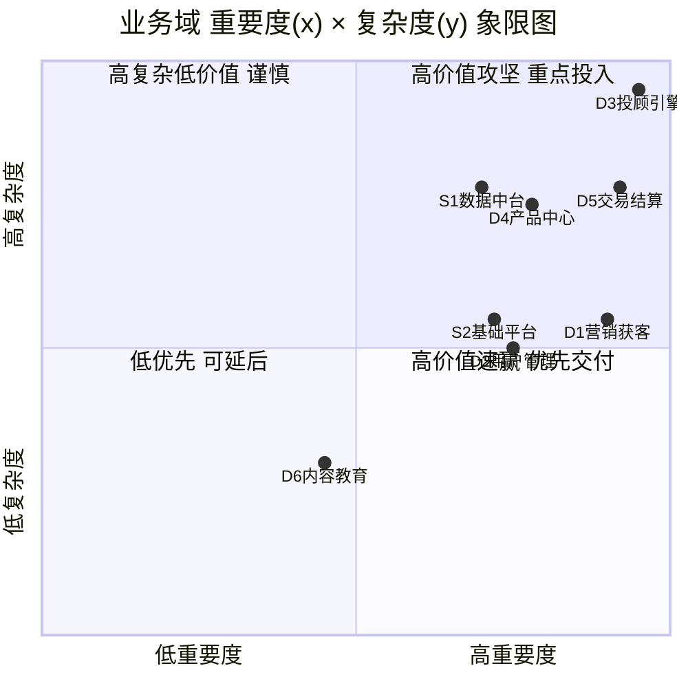
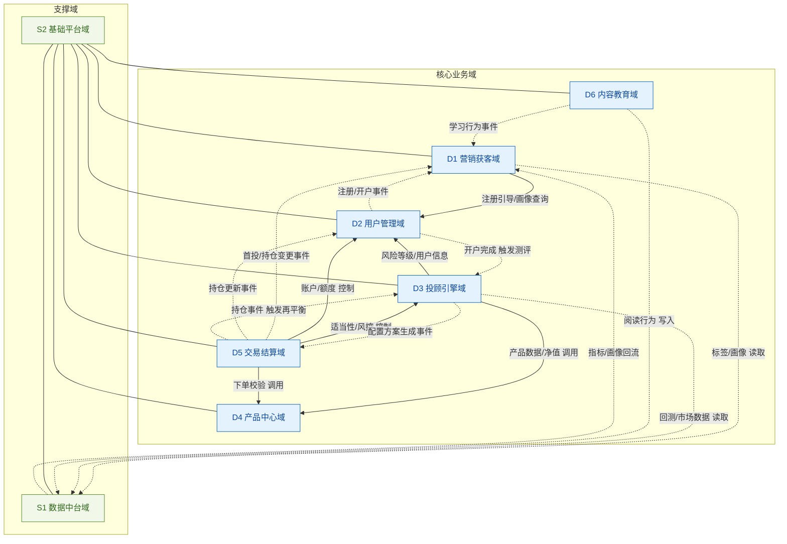
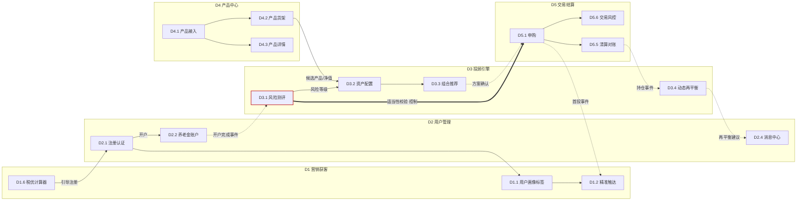
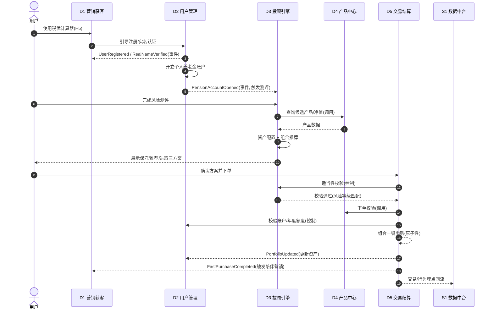
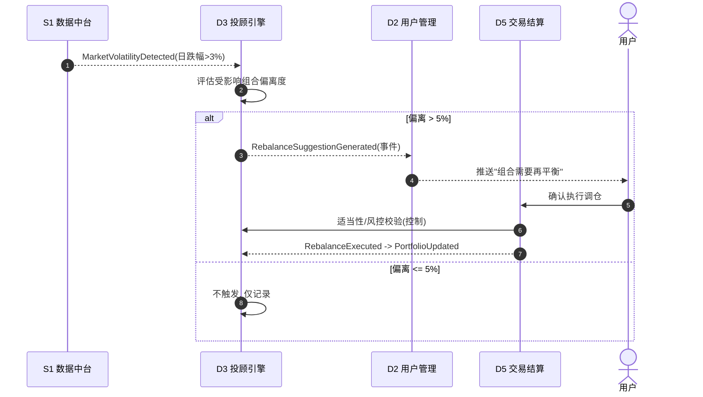
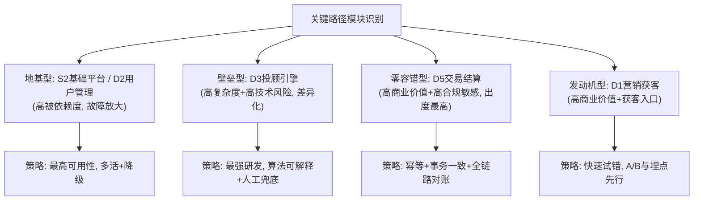
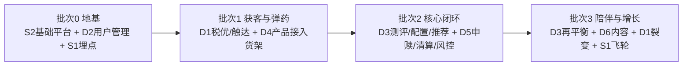

# 个人养老金智能投顾平台 · 业务模块多维度分析

> **文档编号**：MOD-ANALYSIS-PENSION-2026-001
> **版本**：V1
> **日期**：2026-07-02
> **上游文档**：《高阶需求说明书 v1.0》(`docs/pension-hrs-v1.0.md`)
> **状态**：初稿
> **密级**：内部公开

---

## 修订记录

| 版本 | 日期 | 修订内容 | 作者 |
|------|------|----------|------|
| V1 | 2026-07-02 | 初稿：基于 HRS v1.0 的业务模块多维度分析与模块间功能依赖关系建模 | — |

---

## 一、文档目标与分析框架

### 1.1 文档目标

本文档在《高阶需求说明书 v1.0》定义的 **6 个核心业务域 + 2 个支撑业务域** 基础上，完成两件事：

1. **多维度分析**——从重要度、紧迫度、复杂度、商业价值、用户价值、合规敏感度、技术风险、被依赖度等多个维度，对每个业务模块进行量化评估，形成可用于优先级排序和资源分配的决策依据。
2. **功能依赖关系建模**——用 Mermaid 图形化表达业务模块之间的数据依赖、事件依赖、调用依赖与控制依赖，识别关键路径模块、强耦合点和合理的迭代交付顺序。

最终将"多维度分析"与"模块间关系"结合，给出**建设优先级排序、迭代批次划分和解耦治理建议**。

### 1.2 分析维度定义

| 维度 | 英文 | 定义 | 取值 |
|------|------|------|------|
| 重要度 | Importance | 对平台核心价值主张的贡献程度 | 1~5（★） |
| 紧迫度 | Urgency | MVP/首发是否必须具备 | 1~5（★） |
| 复杂度 | Complexity | 技术实现与外部对接的难度 | 1~5（★） |
| 商业价值 | Business Value | 对收入/AUM/获客成本的直接影响 | 1~5（★） |
| 用户价值 | User Value | 在用户旅程中的感知价值 | 1~5（★） |
| 合规敏感度 | Compliance | 涉及资金、适当性、个人信息、审计的程度 | 1~5（★） |
| 技术风险 | Tech Risk | 失败概率与失败影响面 | 1~5（★） |
| 被依赖度 | Fan-in | 有多少其他模块依赖它（入度） | 数值 |
| 依赖度 | Fan-out | 它依赖多少其他模块（出度） | 数值 |

### 1.3 依赖类型定义

模块间的依赖并非单一形态，本文区分四类依赖，用于后续 Mermaid 图的线型语义：

| 依赖类型 | 语义 | 耦合强度 | 典型触发方式 |
|----------|------|----------|--------------|
| **数据依赖**（Data） | A 需要读取 B 产出的数据才能工作 | 中 | 同步查询 / 数据同步 |
| **调用依赖**（Call/API） | A 同步调用 B 的接口并等待返回 | 强 | RPC / REST |
| **事件依赖**（Event） | A 订阅 B 发布的领域事件，异步响应 | 弱 | 消息总线（EDA） |
| **控制依赖**（Control） | A 的执行受 B 的校验/门禁约束 | 强 | 前置校验 / 熔断 |

> 设计原则：**核心域之间优先用事件依赖（弱耦合）解耦，仅在强一致性场景（如交易、适当性校验）使用调用/控制依赖。**

---

## 二、业务模块清单

沿用 HRS v1.0 的域与子域编号，作为后续分析的统一坐标系。

| 域 | 子模块 |
|----|--------|
| **D1 营销获客域** | D1.1 用户画像与标签 · D1.2 精准触达引擎 · D1.3 营销自动化工坊 · D1.4 A/B测试平台 · D1.5 社交裂变工具 · D1.6 税优计算器 |
| **D2 用户管理域** | D2.1 账户注册与认证 · D2.2 养老金账户管理 · D2.3 会员等级体系 · D2.4 消息通知中心 · D2.5 用户偏好管理 |
| **D3 投顾引擎域** | D3.1 风险测评引擎 · D3.2 资产配置引擎 · D3.3 组合推荐引擎 · D3.4 动态再平衡引擎 · D3.5 行为金融学修正 · D3.6 回测与模拟引擎 |
| **D4 产品中心域** | D4.1 产品接入与标准化 · D4.2 产品货架管理 · D4.3 产品详情页 · D4.4 产品对比工具 · D4.5 AI产品解读 · D4.6 产品评价与评分 |
| **D5 交易结算域** | D5.1 申购交易 · D5.2 赎回交易 · D5.3 智能定投 · D5.4 产品转换 · D5.5 资金清算与对账 · D5.6 交易风控 |
| **D6 内容教育域** | D6.1 养老金知识库 · D6.2 退休金模拟器 · D6.3 内容管理系统 · D6.4 互动学习工具 · D6.5 活动运营平台 |
| **S1 数据中台域** | S1.1 数据采集与埋点 · S1.2 实时计算 · S1.3 离线计算 · S1.4 数据仓库 · S1.5 数据治理 |
| **S2 基础平台域** | S2.1 API网关 · S2.2 配置中心 · S2.3 监控告警 · S2.4 安全与合规基础设施 · S2.5 CI/CD与容器编排 |

---

## 三、多维度分析

### 3.1 域级多维度评分

以域为粒度的综合评分（★为 1~5 分，Fan-in/Fan-out 为域级依赖计数，详见第四章）：

| 域 | 重要度 | 紧迫度 | 复杂度 | 商业价值 | 用户价值 | 合规敏感度 | 技术风险 | 被依赖度 | 依赖度 |
|----|:---:|:---:|:---:|:---:|:---:|:---:|:---:|:---:|:---:|
| D1 营销获客 | ★★★★★ | ★★★★★ | ★★★☆☆ | ★★★★★ | ★★★☆☆ | ★★★☆☆ | ★★☆☆☆ | 2 | 3 |
| D2 用户管理 | ★★★★☆ | ★★★★★ | ★★★☆☆ | ★★★☆☆ | ★★★☆☆ | ★★★★★ | ★★★☆☆ | 5 | 2 |
| D3 投顾引擎 | ★★★★★ | ★★★★☆ | ★★★★★ | ★★★★☆ | ★★★★★ | ★★★★☆ | ★★★★★ | 2 | 3 |
| D4 产品中心 | ★★★★☆ | ★★★★★ | ★★★★☆ | ★★★★☆ | ★★★★☆ | ★★★★☆ | ★★★☆☆ | 3 | 2 |
| D5 交易结算 | ★★★★★ | ★★★★★ | ★★★★☆ | ★★★★★ | ★★★★☆ | ★★★★★ | ★★★★☆ | 3 | 4 |
| D6 内容教育 | ★★★☆☆ | ★★★☆☆ | ★★☆☆☆ | ★★★☆☆ | ★★★★☆ | ★★☆☆☆ | ★☆☆☆☆ | 1 | 2 |
| S1 数据中台 | ★★★★☆ | ★★★☆☆ | ★★★★☆ | ★★★☆☆ | ★★☆☆☆ | ★★★☆☆ | ★★★★☆ | 4 | 1 |
| S2 基础平台 | ★★★★☆ | ★★★★★ | ★★★☆☆ | ★★☆☆☆ | ★☆☆☆☆ | ★★★★★ | ★★★☆☆ | 8 | 0 |

> **读图提示**：`S2 基础平台`被依赖度最高（几乎所有域都依赖它），是典型的"地基型"模块；`D3 投顾引擎`复杂度与技术风险最高，是"攻坚型"模块；`D5 交易结算`在商业价值与合规敏感度双高，是"零容错"模块。

### 3.2 重要度 × 复杂度四象限

**解读：**
- **右上（高价值攻坚）**：`D3 投顾引擎`、`D5 交易结算`、`D4 产品中心`、`S1 数据中台`——价值高但复杂，需要投入最强的研发资源与最充分的测试。
- **右下（高价值速赢）**：`D1 营销获客`、`D2 用户管理`、`S2 基础平台`——价值高但相对可控，适合优先落地并快速验证。
- **左下（可延后）**：`D6 内容教育`——重要但非紧急，可由运营侧逐步丰富。

### 3.3 综合优先级评分与建设批次

综合评分 = 重要度×0.25 + 紧迫度×0.25 + 商业价值×0.20 + 用户价值×0.15 − 复杂度×0.10 − 技术风险×0.05（复杂度与风险为负向拉低"性价比"），结果用于建设批次排序：

| 域 | 综合评分 | 建设批次 | 理由 |
|----|:---:|:---:|------|
| S2 基础平台 | 高 | **批次 0（地基）** | 被依赖度最高，其他一切的前置 |
| D2 用户管理 | 高 | **批次 0（地基）** | 账户/认证是所有业务入口 |
| D1 营销获客 | 高 | **批次 1（获客）** | 获客与首投转化的发动机 |
| D4 产品中心 | 高 | **批次 1（弹药）** | 投顾与交易的数据基础 |
| D3 投顾引擎 | 中高 | **批次 2（核心壁垒）** | 差异化竞争力，复杂度高需攻坚 |
| D5 交易结算 | 中高 | **批次 2（价值兑现）** | 零容错，需与 D3/D4 联调 |
| S1 数据中台 | 中 | **批次 2（数据飞轮）** | 支撑精准营销与再平衡 |
| D6 内容教育 | 中低 | **批次 3（陪伴）** | 提升信任与留存，可持续迭代 |

---

## 四、模块间功能依赖关系分析

### 4.1 域级依赖全景图

下图展示 8 个业务域之间的依赖关系，线型区分依赖类型（实线=调用/控制，虚线=事件，点线=数据）。

**关键结论：**
- `S2 基础平台` 被所有域依赖（入度=8），是**单点地基**，其可用性直接决定全局可用性。
- `D2 用户管理` 被 5 个域依赖，是核心域中的**枢纽模块**——账户、风险等级、额度都从这里出。
- `D5 交易结算` 出度最高（依赖 D2/D3/D4），是**下游汇聚点**，联调复杂度最大。
- 核心域间大量采用**事件依赖（虚线）**，符合 EDA 松耦合设计目标。

### 4.2 子模块级功能依赖图

下钻到子模块粒度，展示"从获客到首投再到陪伴"主链路涉及的关键子模块依赖。

> 图中 `D3.1 风险测评 ==> D5.1 申购` 的粗线代表**控制依赖（适当性校验门禁）**：任何交易前必须通过风险适当性校验，是一条不可绕过的合规控制链。

### 4.3 关键业务链路时序图

#### 链路一：新用户首投（获客 → 认证 → 测评 → 配置 → 交易）

#### 链路二：市场波动触发再平衡（数据 → 投顾 → 通知 → 交易）

### 4.4 依赖矩阵（域级）

行=依赖方（谁依赖），列=被依赖方（依赖谁）。`C`=调用/控制、`E`=事件、`D`=数据。

| 依赖方 ↓ \ 被依赖方 → | D1 | D2 | D3 | D4 | D5 | D6 | S1 | S2 |
|---|:--:|:--:|:--:|:--:|:--:|:--:|:--:|:--:|
| **D1 营销获客** | — | C | | | | | D | C |
| **D2 用户管理** | E | — | | | | | | C |
| **D3 投顾引擎** | | C | — | C | | | D | C |
| **D4 产品中心** | | | | — | | | D | C |
| **D5 交易结算** | E | C | C | C | — | | E | C |
| **D6 内容教育** | E | | | | | — | D | C |
| **S1 数据中台** | E | | | | | | — | C |
| **S2 基础平台** | | | | | | | | — |
| **被依赖度(入度)** | **2** | **5** | **2** | **3** | **3** | **1** | **4** | **8** |

> **风险提示**：入度最高的 `S2`（8）与 `D2`（5）是**故障放大点**，需要最高等级的可用性保障（多活、降级预案）；`D5`出度最高，是**联调与回归测试的重心**。

---

## 五、多维度分析 × 模块关系 综合结论

### 5.1 关键路径模块识别

将"多维度评分"与"依赖被依赖度"叠加，识别出三类关键模块：

### 5.2 迭代交付顺序建议

依赖关系决定了交付必须"自底向上"，多维度评分决定了同层内的优先级：

| 批次 | 交付目标 | 关键验收信号 |
|------|----------|--------------|
| 批次 0 | 用户能注册、实名、开户，平台可观测可发布 | 注册→开户闭环打通，监控告警就绪 |
| 批次 1 | 税优获客入口 + 产品可展示 | 税优计算器可分享、产品列表/详情可看 |
| 批次 2 | 从测评到首投的最短闭环 | 新用户首投成功率 ≥ 95%（对应 SYS-01） |
| 批次 3 | 持续陪伴与增长飞轮 | 再平衡建议触达、内容留存、裂变获客 |

### 5.3 解耦与治理建议

| 编号 | 关注点 | 建议 |
|------|--------|------|
| G-01 | 核心域间强耦合 | 除交易/适当性外，域间一律走**领域事件（EDA）**，避免同步调用链过长 |
| G-02 | S2/D2 单点风险 | 基础平台与用户中心做**多活 + 优雅降级**，制定故障放大预案 |
| G-03 | D5 出度过高 | 申购编排采用 **Saga/补偿事务**，保证"全部成功或全部回滚"的原子性 |
| G-04 | 适当性控制链 | `D3→D5` 的适当性校验设为**不可绕过的硬门禁**，并全程留痕（对应 NFR-09） |
| G-05 | 数据回流时延 | 营销所需实时标签走 `S1` 实时链路，非实时画像走 T+1，避免拖累交易主链路 |
| G-06 | 合规敏感模块隔离 | D2/D5/S2.4 涉资金与个人信息，做**独立部署域 + 加密 + 审计**（对应 NFR-06/11/12） |

---

## 附录：图例说明

| 线型 | 含义 |
|------|------|
| 实线箭头 `-->` | 调用依赖（同步 API/RPC） |
| 粗实线 `==>` | 控制依赖（前置校验/门禁） |
| 虚线箭头 `-.->` | 事件依赖（异步领域事件） |
| 点线箭头 `-....->` | 数据依赖（数据读取/同步） |

> 本文档为业务模块多维度分析初稿，与 HRS v1.0 配套使用；后续将随需求评审与架构评审同步迭代。
